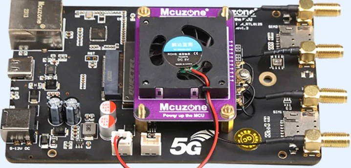

Quectel RGMII Configuration Notes
=================================

> :heavy_check_mark: This guide will mainly focus on the Quectel RM520N-GL. 
However, [Basic configuration](#basic-configuration), [Unlocking and Using ADB](#unlocking-and-using-adb), and [Other interesting things to check over ADB](#other-interesting-things-to-check-over-adb) (except for the  [Qualcomm Webserver](#enable-qualcomm-webserver)), should work on other Quectel 5G modems. (Untested on 4G Quectel modems)

Many of Quectel's modems support directly connecting to a PCIe Ethernet chipset. This is useful to use the cellular connection as a WAN interface - you can just plug the modem into the WAN port on your router, do a bit of configuration, and you're good to go. Performance is good, and the modem's onboard connection management often works better than the scripts many routers use to try to keep the connection up.


> :warning: This is a living document. Changes may be made as more discoveries are made or more software is made

# Table of Contents
- [Quectel RGMII Configuration Notes](#quectel-rgmii-configuration-notes)
- [Table of Contents](#table-of-contents)
- [Hardware Recommendations](#hardware-recommendations)
- [Known issues](#known-issues)
    - [I Can't get internet access from the Ethernet port (Common)](#i-cant-get-internet-access-from-the-ethernet-port-common)
  - [Modem does not automatically connect at startup (Uncommon)](#modem-does-not-automatically-connect-at-startup-uncommon)
- [RM520 Resource Repository](#RM520-Resource-Repository)
  
 - [Basic configuration](#basic-configuration)
   - [First Time Setup](#first-time-setup)
   - [After a firmware Flash; After first time setup](#after-a-firmware-flash-after-first-time-setup)
   - [Changing modem IP address with AT command](#changing-modem-ip-address-with-at-command)
   - [Enabling IP Passthrough](#enabling-ip-passthrough)
     - [QMAP Method (Preferred)](#qmap-method-preferred)
     - [RGMII Method (Not preferred)](#rgmii-method-not-preferred)
  
- [Advanced configuration](#advanced-configuration)
  - [Unlocking and Using ADB](#unlocking-and-using-adb)
    - [Using ADB](#using-adb)
    - [Basic Commands](#basic-commands)
 - [Installing the Telnet Daemon and simpleadmin web GUI](#installing-the-telnet-daemon-and-simpleadmin-web-gui)  
    - [Overview](#overview)
    - [How to install](#how-to-install)
    - [How to uninstall](#how-to-uninstall)
- [Other interesting things to check over ADB](#other-interesting-things-to-check-over-adb)
  - [Enable Daily Reboot](#enable-daily-reboot)
  - [Starting an FTP server](#starting-an-ftp-server)
   - [Changing modem IP address by adb shell](#changing-modem-ip-address-by-adb-shell)
   - [TTL Modification](#ttl-modification)
    - [Installing TTL Override:](#installing-ttl-override)
    - [Removing TTL Override](#removing-ttl-override)
  - [Enable Qualcomm Webserver](#enable-qualcomm-webserver)
  - [Enable journald logging](#enable-journald-logging)
  - [Making sure you're connected to the right modem](#making-sure-youre-connected-to-the-right-modem)
  - [AT Command Access from ADB](#at-command-access-from-adb)

# Hardware Recommendations

I've only used one adapter personally; it's sold on Aliexpress as "5G to 2.5Gbps Ethernet(RJ45) board,USB3.0-C,DC5.5 input, support RM520N-GL RM510Q-GL RM500Q-GL/CN,RTL8125 case", and can either be purchased with or without an RM520N-GL. You can buy it as a bare board or as a kit, including an enclosure, pigtails, fan, heatsink, and antennas. The antennas and heatsink I don't really care for. I'd recommend getting a higher quality copper heatsink and using antennas of your preference. I'd also recommend a 12v 5A power adapter to go along with this.





Here's the seller I purchased from:
https://a.aliexpress.com/_m0hVDKO


Side note - From what i understand, the InvisaGig product sold by Wireless Haven is an RGMII M.2 to Ethernet board with a custom case, copper heatsink on the RM520 coupled with a fan and proper ventilation on the case. They embed a custom GUI in the RM520N, which makes configuration simpler, no need for a USB connection at all. A guide on installing a community made version of a custom GUI will be covered later on in this document. The InvisaGig is expensive compared to DIY, but they also offer a warranty and support. If you're interested:
https://thewirelesshaven.com/shop/modems-hotspots/invisagig/


(If you are using an Invisagig, please don't do any of the stuff mentioned below. Use their UI, or ask for support instead. You're paying a premium to not have to deal with this.)

# Known issues

## I Can't get internet access from the Ethernet port (Common)

### AT+QMAPWAC
Most of the time the issue is because of AT+QMAPWAC

Since AT command documentation is vague and I don't know what the official function of this command is the most likely thing it does is serves as a master auto connect setting. Here are my observations with it: 

 
 - To get current status of it run AT+QMAPWAC?

 ****ON THE CARRIER I USED TO TEST THIS, WILL TEST FURTHER ****
 - If AT+QMAPWAC=1 the Linux/adb shell , the USB NIC, and Ethernet port will request DHCP from the carrier automaticly, resulting in internet access and unique CGNAT IP addresses for each. So far at least in my experience, each have also led to a different public IP.

 - If AT+QMAPWAC=0 then only the USB interface will have internet. In Windows if this doesn't appear while connected by USB then most likely you are in USB ECM mode (`AT+QCFG="usbnet",1` ) instead of USB RMNET mode (`AT+QCFG="usbnet",0`) check device manager. Otherwise you don't have the right driver installed. Install the right driver: [Quectel Windows USB Driver(Q) NDIS V2.4.6](https://drive.google.com/file/d/1nB-yBeqBCMLUXKLWNYVxs8VX6AXw9eOn/view?usp=sharing)
 - A fresh firmware flash will do the following:  
IPPT for both methods will be turned off back to default  
AT+QMAPWAC=1 will go back to AT+QMAPWAC=0

 - Disabling either IPPT methods AT+QMAPWAC=1 will go back to AT+QMAPWAC=0
### Randomly no Internet while in IPPT mode
Run`AT+QMAP="DHCPV4DNS","disable"` and see if it fixes it. This is now part of the IPPT  [QMAP Method (Preferred)](#qmap-method-preferred) section. I have also added an [Enable Daily Reboot](#enable-daily-reboot) section/option as a workaround, however I have not tested it on my own modem yet.
## Modem does not automatically connect at startup (Uncommon)

Some are reporting that when you reboot the modem, it will start in CFUN=0 (minimal function) mode. To get it to connect, you need to issue `AT+CFUN=1`.

I have experienced this myself, but I have found that running the following AT commands via the USB AT port fixes this.
```bash
AT+CFUN=1,1
```
Wait for the modem to reboot then run
```bash
AT+QPRTPARA=1
```
If you are running into this still and the above did not work, a quick and easy hack is to install the [TTL Override:](#installing-ttl-override), but uncomment the line in `ttl-override` (which gets pushed to `/etc/initscripts/ttl-override`):
* Note that if this ttl mod is installed, then the simpleadmin web GUI's TTL will not work (covered later in this doc)

```bash
# If your modem is starting in CFUN=0 mode, uncomment this to pass CFUN=1 to it. Hack, but we'll still keep working to figure out what is causing it.
# echo -e "AT+CFUN=1\r\n" > /dev/smd7
```

Remove the `# ` from before the echo line.

# RM520 Resource Repository 
It is recommended that you check out my  **[RM520N-GL Resource Repository](https://github.com/iamromulan/RM520N-GL)**

There's an autoinstaller .cmd that will get you `Drivers`, `Qflash`, `Qnavigator`, and the last `2 firmwares` installed and put in the right spots. Checkout the C:/Quectel/firmware folder for the firmware after using the .cmd

There's also a [Firmware Flashing Guide](https://github.com/iamromulan/RM520N-GL/tree/main#how-to-install-firmware-with-qflash-windows-) for Windows there 

I will also be adding a how to use Qnavigator guide later there but for now:

 - Basic use: open it up, hit next a bunch of times, press the plug icon at the top, press ok, uncheck automatic initialization, click connect, use the bottom right text box to type an AT command and press enter to send.

# Basic configuration


It is recommended to Flash the latest firmware available before continuing. 

Check out my [RM520 Resource Repository](#RM520-Resource-Repository) 

> Remember:

A fresh flash will do the following:  

 - IPPT for both methods will be turned off back to default  
 - AT+QMAPWAC=1 will go back to AT+QMAPWAC=0
 - Custom software/services installed by adb shell will be removed
 
 ## First Time Setup

```
AT+QCFG="data_interface",1,0  
AT+QCFG="pcie/mode",1  
AT+QCFG="usbnet",0  
AT+QETH="eth_driver","r8125",1  
AT+QMAPWAC=1  
AT+CGDCONT=1,"IPV4V6","apn-here-inside-of-quotes"  
Any other commands you want to run for proper cellular connection  
AT+QPRTPARA=1
AT+CFUN=1,1
```

What these commands do:
* `AT+QCFG="data_interface"`: Configures network port/diag port communication via PCIe and USB. First parameter is for network communication; 0 is USB and 1 is PCIe. Second parameter is for diagnostics port; only option is 0 for USB.
* `AT+QCFG="pcie/mode"`: 1 = RC (Root Complex), IE host. 0 = EP (Endpoint), for use in a device that has the RC
*  `AT+QCFG="usbnet",0`: NIC data call method in USB NIC mode. 0=RMNET
* `AT+QETH="eth_driver","r8125",1`: This configures which ethernet driver to load at module boot. You can run `AT+QETH="eth_driver"` to get a list of options; I believe only one can be enabled. The first parameter is the name of the driver, and the second parameter is a bool to enable or disable.
*  `AT+QMAPWAC`: enable or disable mobile AP auto dial: 0=disable 1=enable (reboot to take effect). You can run `AT+QMAPWAC?` to get what it is currently saved as/set to.
*   `AT+CGDCONT`: Set APN command. Run `AT+CGDCONT` to see what APN profiles 1 through 8 are set to. To clear an APN just send = and the number of the profile you want to clear. For example, if i wanted to clear APN profile 1 I would send `AT+CGDCONT=1` To set an APN you specify the profile number, the protocol (IPV4, IPV6, or IPV4V6 for both) then the APN. For example if I wanted to set APN 1 as APNGOESHERE using both IPV4 and IPV6 i would send `AT+CGDCONT=1,"IPV4V6","APNGOESHERE"`
* `AT+QPRTPARA=1`: Supposed to save current config to memory. l always run it.

..after running `AT+CFUN=1,1` the modem will reboot

## After a firmware Flash; After first time setup
After a firmware Flash these commands need ran
```
AT+QCFG="usbnet",0  
AT+QMAPWAC=1  
AT+CFUN=1,1
```

 - (optional, after reboot) Install Telnet and simpleadmin (Firmware flash gets rid of these)  
 - (optional, after reboot) Set IP Passthrough (Firmware flash turns this off for both methods)

## Changing modem IP address with AT command
By default, the modem acts as a true NAT router for IPv4, and serves addresses via IPv6. The modem's IPv4 address is 192.168.225.1 - this CAN be changed via AT commands [See page 228: AT+QMAP="LANIP"](https://github.com/iamromulan/RM520N-GL/blob/main/Documents/Quectel_RG520N&RG525F&RG5x0F&RM5x0N_Series_AT_Commands_Manual_V1.0.0_Preliminary_20230731.pdf)

There are plenty of reasons that you might need to change the IP of the modem.. IE, you might have multiple modems connected to the same router for WAN load balancing or bonding, or it might conflict with your internal network IP ranges, or (other reasons.) On recent modems like the RM520, Quectel does have a command to do this!

The command is:
```
AT+QMAP="LANIP",<dhcp-start>,<dhcp-end>,<router-ip>,<apply?>
AT+QMAP="LANIP",192.168.227.20,192.168.227.100,192.168.227.1,1
```

The 'apply?' is if the router should apply the changes immediately, or wait until reboot.


## Enabling IP Passthrough

If you want to turn on IP passthrough where the IP address assigned form the cell carrier passes to what connects to the ethernet port, you can! The LAN IP addresses including the gateway are still accessible even while IPPT  (IP Passthrough) is enabled.

There are 2 ways to enable IP Passthrough.

### QMAP Method (Preferred)

This is the method that is documented on page 231 of the  [ 2023-07-31 AT Manual](https://github.com/iamromulan/RM520N-GL/blob/main/Documents/Quectel_RG520N&RG525F&RG5x0F&RM5x0N_Series_AT_Commands_Manual_V1.0.0_Preliminary_20230731.pdf)

#### To enable IP passthrough (QMAP Method):
```
AT+QMAP="MPDN_rule",0,1,0,1,1,"FF:FF:FF:FF:FF:FF"
AT+QMAP="DHCPV4DNS","disable"
AT+CFUN=1,1
```

##### MPDN rule parameters:
* First = mPDN rule number, range 0-3 (unless you're doing something complicated, you'll use 0.)
* Second = APN Profile ID (CGDCONT) to use. You'll probably want 1.
* Third = VLAN ID. This is typically 0 but you can run `AT+QMAP="VLAN"` to find out what it should be
* Fourth = IPPT mode, use 1 for ethernet use 0 for disable
* Fifth = Auto Connect. If set to 0=disabled 1=enabled 
* Sixth = MAC address to pass through to. `FF:FF:FF:FF:FF:FF` will pass the IP to the last connected ethernet device. `”00:00:00:00:00:00”` will pass only to the first connected ethernet device. You can also specify a custom mac address instead. 
##### DHCPV4DNS
Turns the IPV4 DNS proxy on and off. 
I'm pretty sure this causes problems if you use IPPT with a CGNAT address from the carrier. Best to disable this. (Needs more testing, turn off for now just to be safe)

#### To disable IP passthrough (QMAP Method):
```
AT+QMAP="MPDN_rule",0
AT+QMAPWAC=1
AT+CFUN=1,1
```
OR

flash firmware---> follow [After a firmware Flash; After first time setup](#after-a-firmware-flash-after-first-time-setup)


### RGMII Method (Not preferred)

> :warning: Older method,  in my experience it will not turn off unless you flash firmware
#### To enable IP passthrough (RGMII Method):
```
AT+QETH="ipptmac",XX:XX:XX:XX:XX:XX
AT+QETH="rgmii","ENABLE",1,1,1

```
* AT+QETH="ipptmac", the first parameter, formatted as `XX:XX:XX:XX:XX:XX`, should be the MAC address of the device you want to receive the IP passthrough.
* AT+QETH="rgmii":
  * First parameter is "ENABLE" or "DISABLE", to enable or disable RGMII mode.
  * Second parameter is the voltage to use for RGMII. `0`=1.8v and `1`=2.5v. I would recommend running `AT+QETH="rgmii"`, and get the current version from the first line it prints: `+QETH: "RGMII","DISABLE",1,-1` -- it's the '1' after the disable.
  * Third parameter is for IP Passthrough. `-1` = no data call, `0` = COMMON-RGMII (not passthrough), `1` = IP Passthrough-RGMII
  * Optional fourth parameter is if you want to specify a CGDCONT profile to use for this. `0` = not configured, `1` = configured.
  * Optional fifth parameter is the CGDCONT profile ID, 1-8.

#### To disable IP passthrough (RGMII Method):
In theory you should be able to just send `AT+QETH="rgmii","DISABLE"` to disable it. I personally couldn't get it to return to the default value without a firmware flash. If it does work for you you'll probably want to run `AT+QMAPWAC=1` and then reboot `AT+CFUN=1,1` right after.
Otherwise:
flash firmware---> follow [After a firmware Flash; After first time setup](#After-a-firmware-Flash;-After-first-time-setup)


# Advanced configuration

These modems are a full-fledged Linux router under the hood. Once you've got access, you can modify anything you want on the filesystem. It's pretty cool, and also kind of dangerous.. but neat. The access is via 'adb' - the same tool used to do fun stuff to Android phones.

## Unlocking and using ADB

> :bowtie: Thanks to [carp4](https://github.com/carp4) for their work on the [qadbkey-unlock python script](https://github.com/carp4/qadbkey-unlock) we can do this without Quectel's help now!

To get access, you need to get a key salt from the modem, then give that to
the python ADB unlock keygen, take that response to unlock ADB, and then actually enable ADB. This only needs to be done once, as this survives firmware flashing.

To get the key salt, run the AT command "AT+QADBKEY?". The modem will reply with:
```
AT+QADBKEY?
+QADBKEY: 12345678
OK
```
12345678 being the key salt in this case

You then can head over to [The Python ADB unlock key Generator](https://onecompiler.com/python/3znepjcsq)


**Replace the 12345678 with the response you got from running `AT+QADBKEY?`** then click run. Under output your unlock key will be generated.

Once you have received the unlock key, you apply it like this:
```
AT+QADBKEY="0jXKXQwSwMxYoeg"
```

Then, to actually enable ADB, run `AT+QCFG="usbcfg"`, take the output, change the second-to-last 0 to 1, and then send the new usbcfg string to the modem (do _NOT_ just copy/paste what's below; the USB VID/PID for your modem are very likely different):

```control
AT+QCFG="usbcfg"
+QCFG: "usbcfg",0x2C7C,0x0801,1,1,1,1,1,0,0 // Initial response
AT+QCFG="usbcfg",0x2C7C,0x0801,1,1,1,1,1,1,0 // Enable ADB
```

And reboot with `AT+CFUN=1,1` to actually apply.

### Using ADB

Once the modem is back online, you should be able to use ADB to manage the modem on the host connect to it with USB. You'll need to install the ADB drivers and the ADB command line tool before you can use it. The easiest way to do this is just to use the installer from here https://github.com/K3V1991/ADB-and-FastbootPlusPlus/releases

- Download the .exe non-portable version

- Accept, yes, next, allow are pretty much everything you want to be pressing. If you get a security working like this, click more info 
- During the install you'll want these selected for sure. 
- Toward the end, make these are selected like this: 
- The Universal Adb Driver installer will open after, go ahead and accept, yes, next, allow, finish it.
- A window like this will open. 

- Any time you want to use this open ADB & Fastboot++


> :warning: **The other icon/shortcuts are not needed for modems. They are however useful for Android phones. If you only need this for a Quectel modem the icon/shortcuts can be deleted** 
> 

### Basic commands:
In a ADB & Fastboot++ type `adb devices` and press enter. If you have adb unlocked on  your modem and it is connected by usb, you should have at least one device show up on the list. This is a good way to test if adb is installed and properly recognizing your modem or android phone. 
**Example:** 


- `adb pull /path/to/file` - download a file from the modem
- `adb push /path/to/file /path/on/modem` - upload a file to the modem
- `adb shell` - remote control the root linux shell/command line on the modem, type exit when done (note that while in the shell any commands you want to run that normally begin with `adb shell`, that part can be skipped 
  - In the adb shell of a Quectel modem it will behave like a unix shell. Commands like `uname -a` will show you the name of the OS, the processor type, build date info, and more; `ls` will show you the file structure, and `systemctl list-units --type=service --all` will show all services installed running or not.

So far, I have been unsuccessful with my attempts to get ADB to listen on the ethernet interface over IP. Warning the - `adb tcp <port>` command will crash both ADB and all the other serial ports exposed via USB until the modem is restarted. So stick with using ADB over USB for now.
## Installing the Telnet Daemon and simpleadmin web GUI
### Overview
After gaining adb acess, you can install a simple web interface you'll be able to access using the modems gateway IP address. You can see some basic signal stats, send AT commands from the browser, and change your TTL directly on the modem. By default this will be on port 8080 so if you didn't change the gateway IP address you'd go to http://192.168.225.1:8080/ and you'd find this...


Thanks to the work of [Nate Carlson](https://github.com/natecarlson) (Telnet Deamon, Original RGMII Notes), [aesthernr](https://github.com/aesthernr) (Original simpleadmin), and [rbflurry](https://github.com/rbflurry/) (Fixing simpleadmin not functioning) we can install something like this! In order to install it you must first install Nate Carlson's [AT Telnet Daemon](https://github.com/natecarlson/quectel-rgmii-at-command-client/tree/main/at_telnet_daemon) as the [simpleadmin](https://github.com/rbflurry/quectel-rgmii-simpleadmin) depends on it, (a dependency) to work  correctly. Its a Telnet to AT command server. With it, you can connect with a Telenet client like PuTTY on port 5000 to the modems gateway IP (Normaly 192.168.225.1) and send AT commands over Telnet!
### How to install
In order to simplify things I have combined both the [AT Telnet Daemon](https://github.com/natecarlson/quectel-rgmii-at-command-client/tree/main/at_telnet_daemon) and [simpleadmin](https://github.com/rbflurry/quectel-rgmii-simpleadmin) into one repository and one install .sh script file. 

To install both the [AT Telnet Daemon](https://github.com/natecarlson/quectel-rgmii-at-command-client/tree/main/at_telnet_daemon) and [simpleadmin](https://github.com/rbflurry/quectel-rgmii-simpleadmin):
 - Open ADB & Fastboot++ covered in [Using ADB](#using-adb)
 - Make sure your modem is connected by USB to your computer
 - Run `adb devices` to make sure your modem is detected by adb
 - Run `adb shell ping 8.8.8.8` to make sure the shell can access the internet. If you get an error, make sure the modem is connected to a cellular network and make sure `AT+QMAPWAC=1` as covered in the known issue [I Can't get internet access from the Ethernet port (Common)](#i-cant-get-internet-access-from-the-ethernet-port-common)
 - If you don't get an error you should be getting replies back endlessly, press `CTRL-C` to stop it.
 - Run the following commands 
 ```bash
adb shell wget -P /tmp https://raw.githubusercontent.com/iamromulan/quectel-rgmii-simpleadmin-at-telnet-daemon/main/install_on_modem.sh
adb shell chmod +x /tmp/install_on_modem.sh
adb shell sh /tmp/install_on_modem.sh
```
When you run the last one you will be asked yes or no questions. Type yes and press enter for each and be patient. Once done, while connected by ethernet go to http://192.168.225.1:8080/

That's it!! 
### How to uninstall
If you need to uninstall one or the other or both, view the uninstall section of my combo repo: [quectel-rgmii-simpleadmin-at-telnet-daemon](https://github.com/iamromulan/quectel-rgmii-simpleadmin-at-telnet-daemon#uninstallation-automated)

OR

flash firmware---> follow [After a firmware Flash; After first time setup](#after-a-firmware-flash-after-first-time-setup)
# Other interesting things to check over ADB

## Enable Daily Reboot

Run the following commands in adb to install a daily reboot timer. The script should prompt you to enter a daily reboot time in 24 hour format UTC time. If you want to chnage or remove the timer just run the script again.
```bash
adb shell wget -P /tmp https://raw.githubusercontent.com/iamromulan/quectel-rgmii-configuration-notes/main/files/install_daily_reboot.sh
adb shell chmod +x /tmp/install_daily_reboot.sh
adb shell sh /tmp/install_daily_reboot.sh
```

## Starting an FTP server

Once you have root access (adb) to the modem, if you want you can start a temporary FTP server to let you transfer files over the network instead of adb. It will run until you ctrl-c it. Be careful here, it allows full unauthenticated access to the filesystem to whoever can access any of the IPs (if you have a routed public IP, vi that too unless you add firewall rules!) You can change the IP to the modem's LAN address (192.168.225.1 by default) if you'd like.

```bash
tcpsvd -vE 0.0.0.0 21 ftpd /
```

When you connect via FTP, you can just leave the username and password blank.

Note that the BusyBox binary on the modem is compiled without FTP write support. If you would like to enable write support, you can copy files/busybox-armv7l somewhere on the modem (anything under /usrdata is persistent; for this example I created /usrdata/bin), and call that binary instead, with a '-w' flag between ftpd and /; I would also recommend using the current busybox for tcpsvd. You'll also need to add '-A' to ftpd for anonymous access. Example command:

```bash
/usrdata/bin/busybox-armv7l tcpsvd -xE 0.0.0.0 21 /usrdata/bin/busybox-armv7l ftpd -wA /
```

## Changing modem IP address by adb shell

**NOTE**: I am leaving this here for reference sake, but on modern modems, you can indeed change the IP with an AT command. Please reference: [Changing modem IP address with AT command
](#changing-modem-ip-address-with-at-command)

There are plenty of reasons that you might need to change the IP of the modem.. IE, you might have multiple modems connected to the same router for WAN load balancing or bonding, or it might conflict with your internal network IP ranges, or (other reasons.) Unfortunately, Quectel doesn't officially support this, and there is no AT command to do so. However, it's not hard to do.

Make sure you've gained ADB access as described above.

WARNING: You're modifying files on the modem's root filesystem here. If you break it, you buy it, and can keep both pieces!

1. Log into the modem via `adb shell` (If you have multiple modems connected via USB that have ADB enabled, you can get a list of modems with `adb devices`, and connect to the one you want via `adb -s <number> shell`)
2. Change to the `/etc` directory
3. Open `/etc/data/mobileap_cfg.xml` in an editor, and change each occurence of 192.168.225 to whatever you want - for mine, I just went to 192.168.226.
4. Exit ADB, and reboot the router with `AT+CFUN=1,1`

Note that the 192.168.225.1 address is also referenced in `/etc/ql_nf_preload.conf`; I haven't modified that file and everything seems to work, but just so ya know.

## TTL Modification

> :warning: Do not use this at the same time as the Simpleadmin TTL mod. Use either one or the other

This is a Linux router using iptables - so you can add iptables rules to override the outgoing TTL. Certain cell plans may require this for various reasons.

It's probably worth noting that this will also work for modems connected via a USB enclosure.. what this does is directly change the TTL/HL when packets leave the modem, so it really doesn't matter how it's connected to your network.

Make sure you've gained ADB access as described above.

WARNING: You're modifying files on the modem's root filesystem here. If you break it, you buy it, and can keep both pieces!

Files:
* `files/ttl-override`: A simple shell script to start/stop the TTL override. Set the desired TTL with the 'TTLVALUE=' at the top of the script; the default is 64, which will make all packets appear as coming from the modem itself.
* `files/ttl-override.service`: A systemd service to start said script

### Installing TTL Override:

* Mount the root filesystem read-write:
```
adb shell mount -o remount,rw /
```
* Push the files to the system:
```
adb push ttl-override /etc/initscripts
adb push ttl-override.service /lib/systemd/system
```
* symlink the systemd unit, reload systemd, start the service, and remount root as ro again:
```
adb shell chmod +x /etc/initscripts/ttl-override
adb shell ln -s /lib/systemd/system/ttl-override.service /lib/systemd/system/multi-user.target.wants/
adb shell systemctl daemon-reload
adb shell systemctl start ttl-override
adb shell mount -o remount,ro /
```
* The TTL rules will already be active - but you can reboot the modem with `AT+CFUN=1,1` and verify that the rules are automatically added at startup.
* After it comes back up, you can verify the TTL:
```
$ adb shell iptables -t mangle -vnL | grep TTL
 1720  107K TTL        all  --  *      rmnet+  0.0.0.0/0            0.0.0.0/0            TTL set to 64
$ adb shell ip6tables -t mangle -vnL | grep HL
    0     0 HL         all      *      rmnet+  ::/0                 ::/0                 HL set to 64
```

If you want to validate that it's working, you can use "adb shell", and run tcpdump on the network-side interface, specifying that interface's IP as the source (feel free to do that instead of pasting my long ugly string):
```
/ # tcpdump -s0 -v -n -i rmnet_data1 src `ip addr show dev rmnet_data1 | grep '^    inet ' | awk '{ print $2 }' | awk -F'/' '{ print $1 }'`
tcpdump: listening on rmnet_data1, link-type LINUX_SLL (Linux cooked v1), capture size 65535 bytes
17:12:03.064808 IP (tos 0x0, ttl 64, id 55285, offset 0, flags [DF], proto ICMP (1), length 212)
    10.200.255.210 > 8.8.4.4: ICMP echo request, id 16940, seq 2, length 192
```

Note the "ttl 64" - it's working, yay! (The traffic needs to be coming from a host behind the modem for it to really count, which this was.)

### Removing TTL Override

If, for some reason, you want to remove the TTL override, you would need to run:
```
adb shell /etc/initscripts/ttl-override stop
adb shell mount -o remount,rw /
adb shell rm -v /etc/initscripts/ttl-override /lib/systemd/system/ttl-override.service /lib/systemd/system/multi-user.target.wants/ttl-override.service
adb shell mount -o remount,ro /
adb shell systemctl daemon-reload
```
..no need to reboot.

## Enable Qualcomm Webserver
> :warning: Do not use this and the Simpleadmin. Use either one or the other

> :bowtie: This section was contributed by [GitHub user aesthernr](https://github.com/aesthernr). Thanks for the contribution!

Qualcomm provides their OEMs with a tool called QCMAP, which is used to manage the WAN connection, modem IP configuration, etc. They also provide a simple web interface that is supposed to be able to manage some features of the modem. On RM500Q's, it was enable by default, but didn't actually work. The pieces for it are present on the RM520, and it does work, it just needs some work to enable it!

- Mount the root filesystem read-write:

```bash
adb shell mount -o remount,rw /
```

- Push the files to the system:

```bash
cd /path/to/quectel-rgmii-configuration-notes/files
adb push qcmap_httpd.service /lib/systemd/system
adb push qcmap_web_client.service /lib/systemd/system
```

- Reset the username/password to admin/admin. You will be able to update this after first login.

```bash
adb push lighttpd.user /data/www
adb shell chmod www-data:www-data /data/www/lighttpd.user
```

- Symlink the systemd unit, reload systemd, start the service, and remount root as ro again:

```bash
adb shell chmod +x /etc/initscripts/start_qcmap_httpd
adb shell chmod +x /etc/initscripts/start_qcmap_web_client_le
adb shell ln -s /lib/systemd/system/qcmap_httpd.service /lib/systemd/system/multi-user.target.wants/
adb shell ln -s /lib/systemd/system/qcmap_web_client.service /lib/systemd/system/multi-user.target.wants/
adb shell systemctl daemon-reload
adb shell systemctl start qcmap_httpd
adb shell systemctl start qcmap_web_client
adb shell mount -o remount,ro /
```

- Open your Browser to [http://192.168.225.1/QCMAP.html](http://192.168.225.1/QCMAP.html) (replace the IP if necessary) - you can authenicate as admin/admin. It will prompt you to change your password after login. Note that WLAN settings will not do anything unless you have a supported wireless card connected via PCIe; that is out of scope for this document. It's also unknown if all the other functions will work as expected - however, a factory reset should wipe out all of these settings.

## Enable journald logging

By default, journald is masked on the modem - IE, nothing systemd does will end up having persistent logs. To fix this, we need to manually modify files in the root filesystem, as /etc isn't available at the point this is started.

Before enabling, I would recommend modifying /lib/systemd/journald.conf.d/00-systemd-conf.conf with some tweaks to prevent it from using lots of space:

```bash
adb shell mount -o remount,rw /
adb shell
# vi /lib/systemd/journald.conf.d/00-systemd-conf.conf
###edit params as below, and then save changes, and exit the shell###
adb shell mount -o remount,ro /
```

The config file by default has:

```bash
[Journal]
ForwardToSyslog=yes
RuntimeMaxUse=64M
```

I would recommend:

```bash
[Journal]
ForwardToSyslog=no
RuntimeMaxUse=16M
Storage=volatile
# Lots of spammy units, so limit the logging bursts.
RateLimitIntervalSec=5m
RateLimitBurst=100
```

This disables forwarding to the syslog daemon (to avoid taking up space twice), forces runtime (RAM) storage, and limits it to 16mb. It also enables fairly aggressive rate limiting, so that apps like ipacm won't force constant rotation.  (Each service gets its own rate limit.)

Here's how to enable the service:

```bash
adb shell mount -o remount,rw /
adb shell rm /lib/systemd/system/sysinit.target.wants/systemd-journald.service /lib/systemd/system/sockets.target.wants/systemd-journald.socket /lib/systemd/system/sockets.target.wants/systemd-journald-dev-log.socket
adb shell ln -s /lib/systemd/system/systemd-journald.service /lib/systemd/system/sysinit.target.wants/systemd-journald.service
adb shell ln -s /lib/systemd/system/systemd-journald.socket /lib/systemd/system/sockets.target.wants/systemd-journald.socket
adb shell systemctl daemon-reload
adb shell systemctl start systemd-journald.socket systemd-journald.service systemd-journald-dev-log.socket
# Also, to avoid lots of junk about write perms on unit files.. if you push the systemd units from a windows box, you might need to clean this up more often!
adb shell chmod 644 /lib/systemd/system/*.service /lib/systemd/system/*.socket /lib/systemd/system/*.conf
adb shell chmod 644 /lib/systemd/system/dbus.service.d/dbus.conf /lib/systemd/system/systemrw.mount.d/systemrw.conf
adb shell mount -o remount,ro /
```

Then, we have to unmount the mounted /etc directory, and remove the underlying masking of journald. We'll need to reboot the system to get the real /etc back:

```bash
adb shell umount -l /etc
adb shell mount -o remount,rw /
adb shell rm /etc/systemd/system/systemd-journald.service
adb shell mount -o remount,ro /
adb shell sync
adb shell reboot -f
```

If you also want to enable audit logs, also do the following as part of the above:

```bash
adb shell rm /lib/systemd/system/sockets.target.wants/systemd-journald-audit.socket
adb shell ln -s /lib/systemd/system/systemd-journald-audit.socket /lib/systemd/system/sockets.target.wants/systemd-journald-audit.socket
```

I am leaving systemd-journal-flush disabled (masked), as we don't want to write the logging data to persistent storage. Well - if you do you can change the Storage to "persistent" in the config file, and also symlink the systemd-journal-flush to actually switch from volitile to persistent storage on bootup.


### Making sure you're connected to the right modem

If you have multiple modems connected to one host, as I do, it can be hard to remember which serial number is which modem. There is a file in /etc that at least shows you the model number:

```
/ # cat /etc/quectel-project-version
Project Name: RM520NGL_VC
Project Rev : RM520NGLAAR01A07M4G_01.201
Branch  Name: SDX6X
Custom  Name: STD
Package Time: 2023-03-14,09:49
```

### AT Command Access from ADB

It appears that the following processes are used to expose the serial ports via USB:
```
  155 root      0:00 /usr/bin/port_bridge at_mdm0 at_usb0 0
  162 root      0:00 /usr/bin/port_bridge smd7 at_usb2 1
```

The daemon for AT over Ethernet also interfaces with smd7:
```
/tmp # fuser /dev/smd7
162 809
/tmp # ps | grep -E '(162|809)'
  162 root      0:00 /usr/bin/port_bridge smd7 at_usb2 1
  809 root     28:22 /usr/bin/ql_nw_service
23314 root      0:00 grep -E (162|809)
/tmp # lsof -p 809 2>/dev/null | grep -Ev '/usr/bin|/lib/|/dev/null|/$'
COMMAND   PID     USER   FD      TYPE     DEVICE SIZE/OFF  NODE NAME
ql_nw_ser 809        0    3u     unix 0x00000000      0t0 18565 type=SEQPACKET
ql_nw_ser 809        0    4u     sock        0,8      0t0 18740 protocol: QIPCRTR
ql_nw_ser 809        0    5r     FIFO       0,11      0t0 18741 pipe
ql_nw_ser 809        0    6w     FIFO       0,11      0t0 18741 pipe
ql_nw_ser 809        0    7u     sock        0,8      0t0 18863 protocol: QIPCRTR
ql_nw_ser 809        0    8r     FIFO       0,11      0t0 18864 pipe
ql_nw_ser 809        0    9w     FIFO       0,11      0t0 18864 pipe
ql_nw_ser 809        0   10u      CHR      246,4      0t0  6291 /dev/smd7
ql_nw_ser 809        0   11u     IPv4      20353      0t0   TCP *:1555 (LISTEN)
ql_nw_ser 809        0   12u  a_inode       0,12        0  6222 [eventpoll]
```

So, a simple way to send/receive commands.. open two adb shell sessions to the modem, in one, run `cat /dev/smd7`. In the other, you run the AT commands. Example:

Listening shell:
```
/ # cat /dev/smd7
AT
OK
ATI
Quectel
RM520N-GL
Revision: RM520NGLAAR01A07M4G

OK
```

Command shell:
```
/tmp # echo -e 'AT \r' > /dev/smd7
/tmp # echo -e 'ATI \r' > /dev/smd7
```

It appears that smd11 and at_mdm0 can also be used for this. On a default-ish modem, it appears that smd7 and at_mdm0 are both used by running daemons, so I picked smd11 for my AT daemon. There is a service called 'quectel-uart-smd.service', in it's unit file it disables the quectel_uart_smd, and says that smd11 is used by MCM_atcop_svc. However, I see no signs of that on the system.. so I think it's probably the safest to use.


