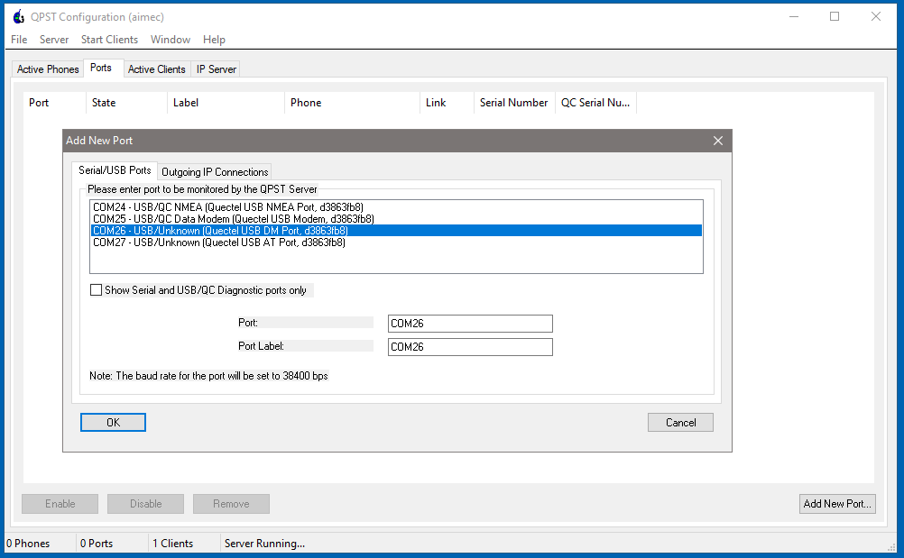

Fibocom Modem Wiki
=================================
> :book: This is a living Wiki. Changes may be made as more discoveries are made or more community software is made. If you feel like you have information to contribute to this wiki please open a pull request.

# Backup firmware with QPST

> Open Qpst Configuration.

>> Use the AutoAdd function to autoconnect to proper serial port "DEADD00D sn 4ec33ae0 DIAGnostic" or
>> 
>> Select Ports tab.
>> Add New Port.\
>> "Show serial and USB/QC diagnostic port only": NO.\
>> Add "USB DM Port".\
>> Just ignore the other ports "USB NMEA, USB Modem, AT".

> Navigate to Start Clients > Software Downloads > Backup tab.

> Go to xQCN File field, browse backup directory, give filename and press Start. The file is created into "C:\<path>\DEADD00D_0.xqcn". Wait for the load bar get to the and and look for "Memory Backup Completed" message.

> Next close QPST window completely even from the system tray.

# Backup firmware with QFIL as well
(To backup few other things, like IMEI.)

> Open QFIL.
>> Go to Configuration tab -> Firehose configuration:\
>> Download protocol can stay default Sahara.\
>> The device type is NAND.\
>> No validation.\
>> Don't use the auto backup restore QCN options on the right.\
>> \*"Reset after download" just means it'll reboot after it finishes so keep that checked.\
>> The big thing here is to select \*"Erase all before download". This will erase what you backed up into the xqcn and allow a full clean flash to occur with the 551 firmware.

>> Select Port.\
>> Flag "Show Non QDLoader/DIAG Port"\
>> Choose "Quectel USB DM Port"

>> Go to Tools tab.\
>> QCN backup restore.\
>> Browse and give filename "C:\<path>\00000000.qcn", SPC Code 000000, Enable Multi-SIM YES.\
>> Press Backup QCN.\
>> Wait for the load bar to finish and look for "Backup QCN Succeeded"

> Close QCN Backup Restore window.

