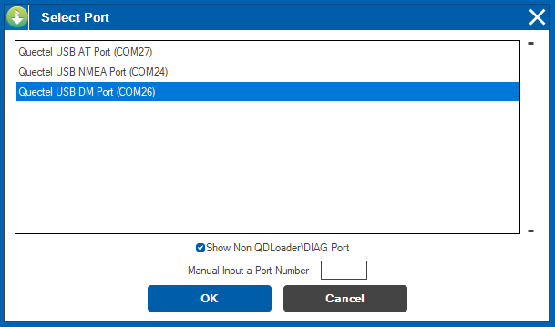

Fibocom Modem Wiki
=================================
> :book: This is a living Wiki. Changes may be made as more discoveries are made or more community software is made. If you feel like you have information to contribute to this wiki please open a pull request.

# Using Qflash to flash a modem
(WIP: adapt original content from Quectel)

# Using QFIL to flash a modem

These directions are written with Fibocom based M.2 modems in mind. 
### File Path Note

>:bulb: Both the path to Qflash and your extracted firmware must not have spaces in it. Example: C:\Quectel\Q flash\ is bad while C:\Quectel\Qflash\ is good. If you installed Qflash and got your firmware through [QuecDeploy](https://github.com/iamromulan/QuecDeploy/releases) then you don't have to worry about this. 

Step 1.
> Install the latest NDIS Driver (Note that only one driver can be installed at once besides the ECM driver) Get it from [QuecDeploy](https://github.com/iamromulan/QuecDeploy/releases) or from my [Mega Public Folder](https://mega.nz/folder/CRFWlIpQ#grOByBgkfZe5uLMkX2M2XA) 

Step 2.
> Connect modem to your computer, by USB

Step 3.
> Go to device manager and check if the new COM ports are visible in the system. Restart your computer if the new COM ports are not visible.

> Remember the number of the COM port described as "DM Port".

Step 4.

> Open QFIL.

> Configurate QFIL
> Go to Configuration tab -> Firehose configuration:
> Download protocol can stay default Sahara.
> The device type is NAND.
> No validation.
> Don't use the auto backup restore QCN options on the right.
> Reset after download just means it'll reboot after it finishes so keep that checked.
> The big thing here is to select "Erase all before download". This will erase what you backed up into the xqcn and allow a full clean flash to occur with the 551 firmware.

Step 5.
> Select the COM port number as the DM port from step 3

Step 6.
> Get the ubi files and others.
> Copy everything in there into the firehose folder. Make sure the path to the firmware doesn't have any spaces in it at all, like "C:\Users\user name\firmware" is bad. "C:\Users\username\firmware" is good. This is why I just use C:\Quectel for QuecDeploy. Launch QuecDeploy. Firmware downloads -> RM551E-GL -> Custom Firmware -> RM551_xxxx_iamromulan_basic_eth.
> The zip file will be downloaded to "C:\Quectel\firmware\RM551EGL\Custom\RM551EGL00AAR01A02M8G_2025_4_21_iamromulan_basic_eth"

> In the new window, go to the `\update\firehose` folder of the firmware and select the `partition_complete` file or the `prog_firehose` file. Then click the Open button. 

> If you downloaded your firmware with [QuecDeploy](https://github.com/iamromulan/QuecDeploy/releases) then go to C:\Fibocom\firmware\<modem>\<type>\<firmware>\update\firehose\

Step 7.
> Now go back in QFIL and select Flat Build.

> Programmer path, click browse, go to the "C:\Quectel\firmware\RM551EGL\Custom\RM551EGL00AAR01A02M8G_2025_4_21_iamromulan_basic_eth\update\firehose"
folder and select the "prog_firehose" file.
> Then below that click load XML, select the only file it'll show you (rawprogram_nand_p4K_b256K_update.xml), it'll ask for another one (patch_p4K_b256K.xml), same thing only one there.

> Finally hit download and watch it go. Log file is located in "C:\Users\gio\AppData\Roaming\Qualcomm\QFIL\COMPORT_12\port_trace.txt"

> The module will reboot into EDL mode, as a Quectel model for the first time. At this point you'll want to have the Quectel drivers installed as it'll identify as a Quectel module over USB.

> Go into Qnavigator (uncheck automatic initialization) or your AT command program of choice and send ATI to confirm.

ATI
+Quectel
+RM551E-GL
+Revision: RM551EGL00AAR01A02M8G -> RM551EGL00AAR01A04M8G

Once the flash completes wait for the ports to come back up in device manager. Once they come back, wait about 30 seconds +/- for the second reboot to occur. AT+QCFG= pcie/mode,1 and AT+QCFG=usbnet,1 are sent then it reboots. Once the second reboot occurs ethernet will be working with Luci and SSH acess at 192.168.224.1. Pre-set root password is iamromulan. Based on Stock firmware: RM551EGL00AAR01A02M8G (2024-12-23)

At the end of the flash process the modem will automatically reboot and QFIL shoudl say PASS!

If you get any errors ensure the USB connection is stable or try a different computer. Once the flash process makes it past the beginning loading bar phase do not interrupt the process or you could leave the modem in an unusable bricked state. You'll have to enter EDL manually to revive it if this happens.

If you run AT+CFUN? You'll notice it's not 1 it's some other number.
AT+CFUN?
+CFUN: 5

It means it's missing its xqcn and the radio won't work until a compatible one is restored. You'll grab the xqcn I made available in my mega share I backed up from a real RM551 "https://mega.nz/folder/CRFWlIpQ#grOByBgkfZe5uLMkX2M2XA/file/LZ80TZLD" and restore it in QPST under the restore tab with following steps:

Launch Qpst Configuration -> Add new port (if not detected automatically) -> Look for DM port
Go to Software Donwload tab -> Restore
  Check allow esn mismatch
  Select the xqcn you download from my mega and click Start. During  the restore process you can see the modem status throught TeraTerm serial sessions (CFUN: 5 > CFUN: 7 > Disconnected > READY). The module will automatically reboot, after it completes "Memory Restore Completed" message.

Check CFUN again to confirm you can enter CFUN=1 now and that should be it.

Double backup (qFil+Qpst) new modem firmware RM551E-GL now!

> :book: WIP ############### content and formatting to fix

   AT+CFUN?
   AT+CFUN=1
   +CME ERROR: 4
   +CFUN: 1
   AT+CFUN=1,1
