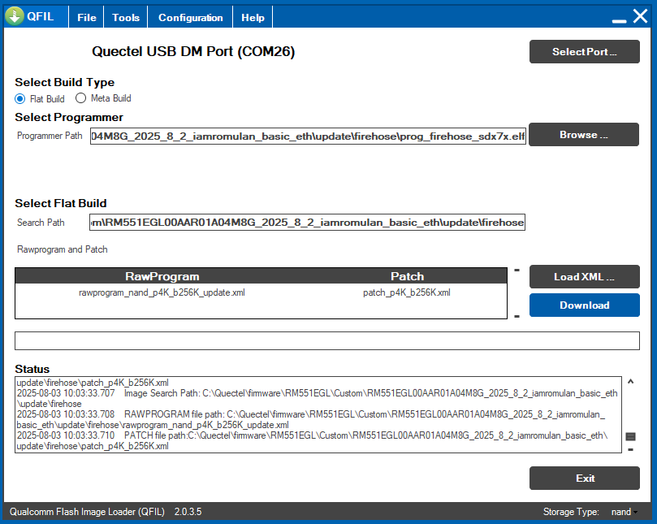
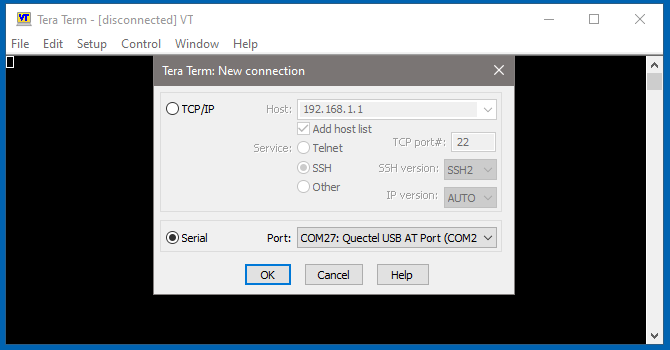

Fibocom Modem Wiki
=================================
> :book: This is a living Wiki. Changes may be made as more discoveries are made or more community software is made. If you feel like you have information to contribute to this wiki please open a pull request.

# Flashing firmware

> Open QFIL and make sure the Port is detected as per [Intro Config](./introduction.md#qfil-configuration)
>> Select Flat Build.\
>> Browse Programmer path to "C:\<path>\update\firehose" folder and select the "prog_firehose_xxx.elf" file.\
>> Load XML and select the only file it'll show you (rawprogram_nand_p4K_b256K_update.xml), it'll ask for another one (patch_p4K_b256K.xml), same thing only one there.\
>> Finally hit download and watch it go. Log file is located in "C:\Users\\<user\>\AppData\Roaming\Qualcomm\QFIL\COMPORT_12\port_trace.txt"

> Once the flash completes wait for the ports to come back up in device manager. Once they come back, wait about 30 seconds +/- for the second reboot to occur.\
> "AT+QCFG= pcie/mode,1" and "AT+QCFG=usbnet,1" are sent then it reboots.\
> Once the second reboot occurs ethernet will be working with Luci and SSH acess at 192.168.224.1.\
> Pre-set root password is iamromulan.

> At the end of the flash process the modem will automatically reboot and QFIL shoudl say PASS!\
> If you get any errors ensure the USB connection is stable or try a different computer. Once the flash process makes it past the beginning loading bar phase do not interrupt the process or you could leave the modem in an unusable bricked state. You'll have to enter EDL manually to revive it if this happens.

## Rebooting

> The module will reboot into EDL mode, as a Quectel model for the first time. At this point you'll want to have the Quectel drivers installed as it'll identify as a Quectel module over USB.\

> Launch Serial Connection
>> TeraTerm (or for Qnavigator remember to uncheck automatic initialization)\
>> During rebooting process make sure you open a serial window on AT port, to watch what is going.

>> Select serial "Quectel USB AT Port" -> Ok\
>> Check FUNctionality using ATI commands\
>> ATI;+CFUN?
>>> +Quectel
>>> +RM551E-GL
>>> +Revision: RM551EGL00AA<R01>A02M8G -> RM551EGL00AA<R01>A04M8G -> RM551EGL00AA<R02>A01M8G
>>> +CFUN: 5

## VERY PORTANT NOTE:
> If AT+CFUN? gives >1 it means it's missing its xqcn and the radio won't work until a compatible one is restored.\
> You'll grab the xqcn you previosly made from YOUR ORIGNAL module at LAST firmware version or\
> if you didn't, I made available in my mega share I backed up from a real RM551 "https://mega.nz/folder/CRFWlIpQ#grOByBgkfZe5uLMkX2M2XA/file/LZ80TZLD".

## Launch Qspt to Restore radio calibration
> Launch Qpst Configuration -> Add new port (if not detected automatically) -> Look for DM port\
> Go to StartClients -> Software Donwload tab -> Restore\
> Check allow "ESN mismatch"\
> Browse and select the Xqcn file and click Start

> During  the restore process you can see the modem status throught TeraTerm serial sessions:\
> (CFUN: 5 > CFUN: 7 > Disconnected > READY).\
> The module will automatically reboot, showing "Trying to communicate with phone" and after it completes "Memory Restore Completed" messages.

> Open/Re-open a serial connection (i.e TeraTerm) on AT port to check CFUN again and confirm you entered CFUN: 1
>> AT+CFUN?;+CFUN=1
>>> +CFUN: 1
>>> +CME ERROR: 4 // double check you flagged "Allow ESN mismatch" in QPST Restore tab or you choosed a corrupted Xqcn file

> If you are on windows system , you'll see a new ethernet network on "Control Panel\Network and Internet\Network Connections":

> Double backup (qFil+Qpst) new modem firmware now!

