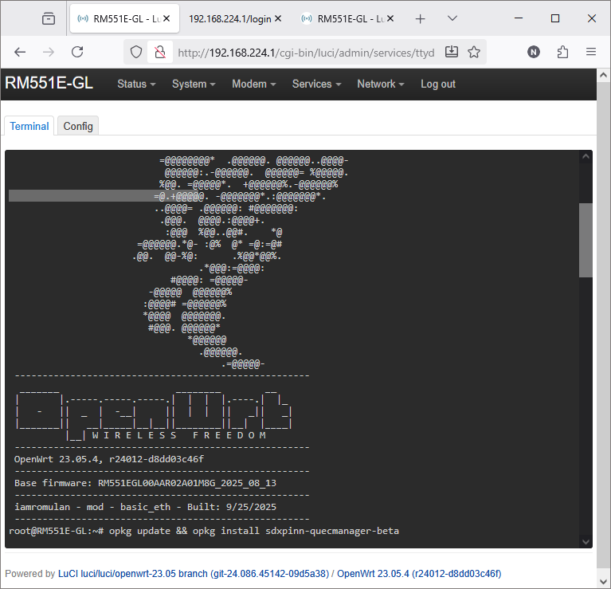
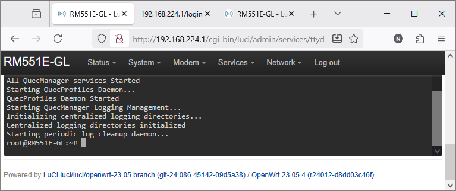

Fibocom Modem Wiki
=================================
> :book: This is a living Wiki. Changes may be made as more discoveries are made or more community software is made. If you feel like you have information to contribute to this wiki please open a pull request.

# Install QuecManager

> You can choose from several options.
> 
> a) Use ssh console at http://192.168.224.1/cgi-bin/luci/admin/services/ttyd
>> RM551E-GL login:root / psw:iamromulan\
>> opkg update\
>> \#\* opkg install sdxpinn-console-menu\
>> \#\* opkg install sdxpinn-firstboot\
>> \#\* opkg install sdxpinn-mount-fix\
>> \#\* opkg install sdxpinn-patch\
>> opkg install sdxpinn-quecmanager-beta # or opkg install sdxpinn-quecmanager-beta
>>
>> \#\* (not needed for firmware version R02)

> b) Use ssh console at http://192.168.224.1/cgi-bin/luci/admin/services/ttyd
>> menu # /usr/bin/menu

> c) Use ssh console via Powershell
>> adb shell
>> / # opkg update
>> / # opkg install sdxpinn-quecmanager-beta

> d) Use LuCI Graphic User Interface
>> Visit http://192.168.224.1/cgi-bin/luci/admin/system/opkg \
>> Update lists\
>> Select "sdxpinn-quecmanager-beta" or "sdxpinn-quecmanager"\
>> Install

Goto next step [Appendix](./appendix.md)
