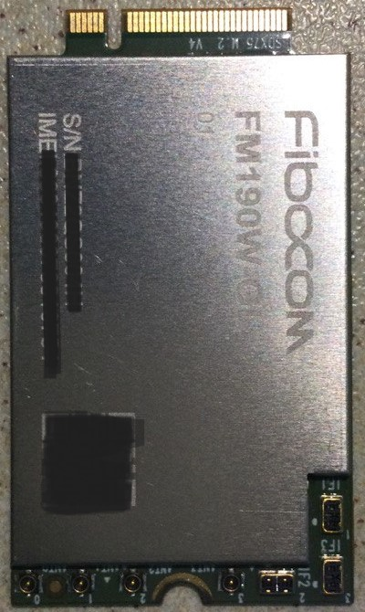
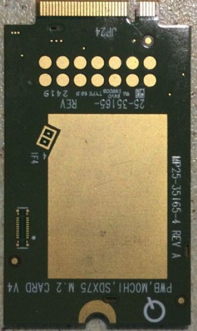

Fibocom Modem Wiki
=================================
> :book: This is a living Wiki. Changes may be made as more discoveries are made or more community software is made. If you feel like you have information to contribute to this wiki please open a pull request.

# FM190W-GL

The FM190W-GL is brand new and is currently in 01 phase (Production). The aboce pictures show a Rev4 modem.

The Fibocom FM190W-GL is a cellular NR/LTE (5G/4G) M.2 B-Key modem module specially optimized for a variety of applications and usage scenarios utilizing the Qualcomm x75 platform.

> :book: [Preliminary guide to convert a Fibocom FM190W-GL to an RM551E-GL](./FM190W-GL_to_RM551E-GL.md)
