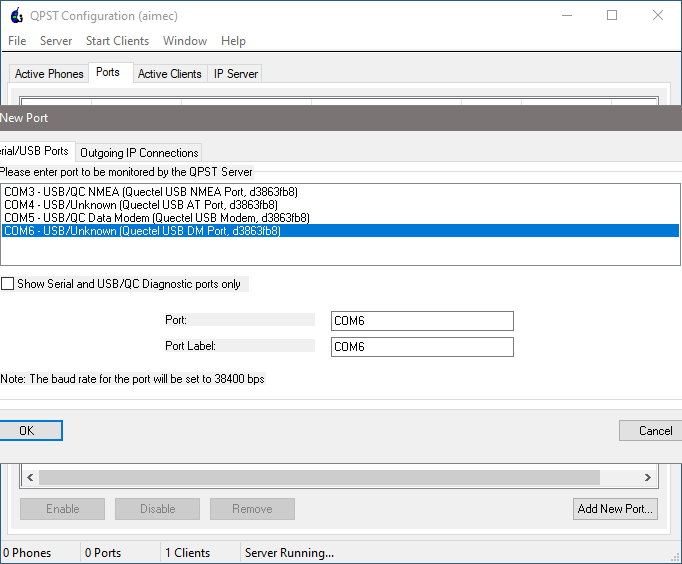
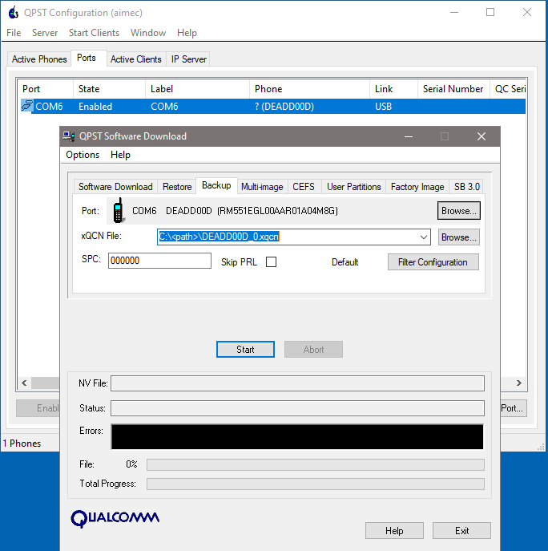
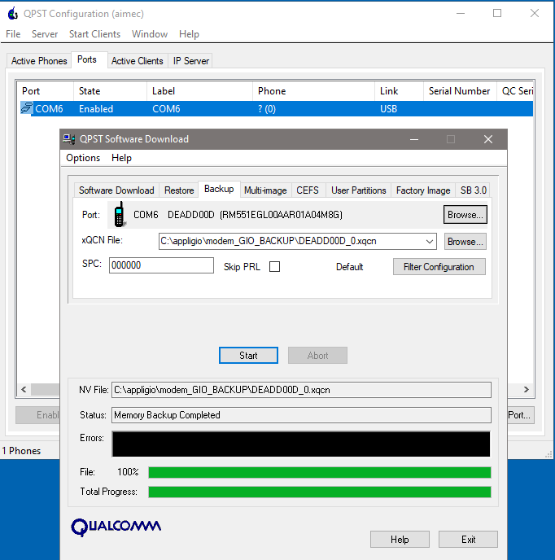
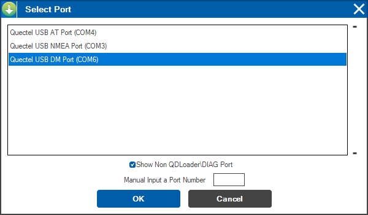
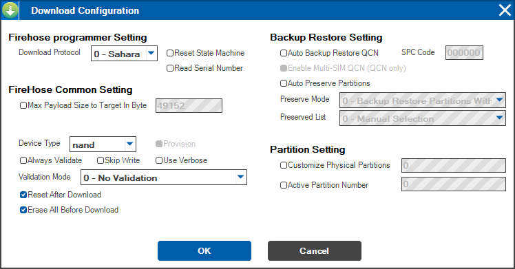

Quectel Modem Wiki
=================================
> :book: This is a living Wiki. Changes may be made as more discoveries are made or more community software is made. If you feel like you have information to contribute to this wiki please open a pull request.

# Backup Actual Firmware

Before you proceed with any flash/download/restore/downgrade/upgrade/update process, make sure you backup actual firmware. There are unique data stored into your module needed for NV Radio Calibration and other factory pre-settings.

Step 1.
> Open QPSTt Configuration

Step 2.
> Use the AutoAdd function to autoconnect to proper serial port "DEADD00D sn ******* DM Port"\
> If you can't see any port, select Ports tab and press Add New Port button.\
> Than unflag "Show serial and USB/QC diagnostic port only".\
> Select "USB DM Port" and just ignore the other ports "USB NMEA, USB Modem, AT".

Step 3.
> Navigate to Start Clients > Software Downloads > Backup tab.

Step 4.
> Go to xQCN File field, browse backup directory, give filename and press Start. The file is created into "C:\<path>\DEADD00D_0.xqcn". Wait for the load bar get to the and and look for "Memory Backup Completed" message.

> Next close QPST window completely even from the system tray.

# Backup firmware with QFIL as well
(To backup few other things, like IMEI.)

Step 1.
> Open QFIL and select the COM port number as the DM port.\
> Flag "Show Non QDLoader\DIAG Port".\
> Press "OK"

Step 2.
> Select "Flat Build"

Step 3.
> Go to Configuration tab -> Firehose configuration:

> Download protocol can stay default Sahara.\
> The device type is NAND.\
> No validation.\
> Don't use the auto backup restore QCN options on the right.\
> Reset after download just means it'll reboot after it finishes so keep that checked.\
> The big thing here is to select "Erase all before download". This will erase what you backed up into the xqcn and allow a full clean flash to occur with the 551 firmware.

Step 4.
> Go to Tools tab.\
> QCN backup restore.\
> Browse and give filename "C:\<path>\00000000.qcn", SPC Code 000000, flag Enable Multi-SIM.\
> Press Backup QCN.

> Wait for the load bar to finish and look for "Backup QCN Succeeded"

> Close QCN Backup Restore window.
