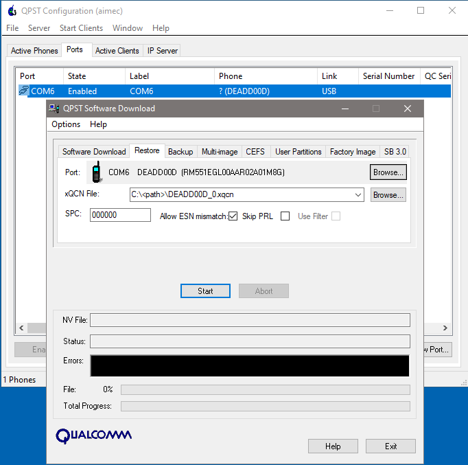
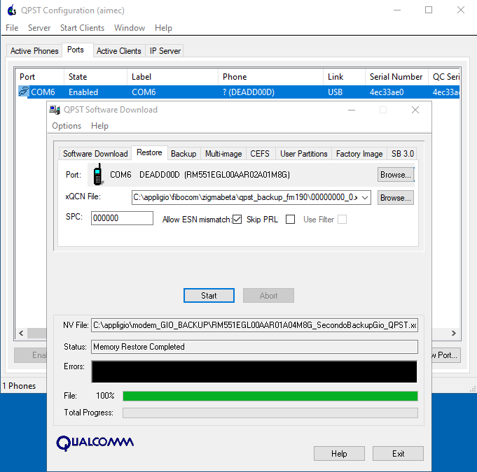

Quectel Modem Wiki
=================================
> :book: This is a living Wiki. Changes may be made as more discoveries are made or more community software is made. If you feel like you have information to contribute to this wiki please open a pull request.

# Flashing, Rebooting and Restoring

You'll need a bunch of ubi files and others along with a firehose folder. Copy everything in there into the firehose folder. Make sure the path to the firmware doesn't have any spaces in it at all. "C:\Users\user name\firmware" is bad "C:\Users\username\firmware" is good. This is why I just use C:\Quectel for QuecDeploy.

Goto Firmware downloads \<model\> \<version> -> Custom Firmware -> Select "basic_eth" file if you plan to use the compatible modem in an ethernet sled.

The zip file will be downloaded to "C:\Quectel\firmware\\<model\>\\<version\>\Custom\\*****_iamromulan_basic_eth".

# Using Qflash to flash a modem

Step 1.
> Open QFlash 

> Ensure your firmware is downloaded and extracted from the zip and no spaces are in the path to it/where its saved. Click Load FW Files.

> In the new window, go to the `\update\firehose` folder of the firmware and select the `partition_complete` file or the `prog_firehose` file. Then click the Open button. 

> If you downloaded your firmware with [QuecDeploy](https://github.com/iamromulan/QuecDeploy/releases) then go to C:\Quectel\firmware\<modem>\<type>\<firmware>\update\firehose\

Step 2.
> Select the COM port number as the DM port from step 3 and set the baud rate to `460800`

Step 3.
> Start updating modem firmware.

At the end of the flash process the modem will automatically reboot and QFlash shoudl say PASS!

If you get any errors ensure the USB connection is stable or try a different computer. Once the flash process makes it past the beginning loading bar phase do not interrupt the process or you could leave the modem in an unusable bricked state. You'll have to enter EDL manually to revive it if this happens.

# Using QFIL to flash a modem

Step 1.
> Open QFIL and double check is settings are been kept from the previus [backup](backup.md) session.

Step 2.
> Browse Programmer path to "C:\<path>\update\firehose" folder and select the "prog_firehose_xxx.elf" file.

Step 3.
> Load XML and select the only file it'll show you (rawprogram_nand_p4K_b256K_update.xml), it'll ask for another one (patch_p4K_b256K.xml), same thing only one there.

Step 4.
> Finally press "Download" and watch it go. Log file is located in "C:\Users\\<user\>\AppData\Roaming\Qualcomm\QFIL\COMPORT_12\port_trace.txt"

# Rebooting
> Once the flash completes wait for the ports to come back up in device manager.\
> Once they come back, wait about 30 seconds +/- for the second reboot to occur.\
> "AT+QCFG= pcie/mode,1" and "AT+QCFG=usbnet,1" are sent then it reboots.\
> Once the second reboot occurs ethernet will be working with LuCI and SSH access at [192.168.224.1](http://192.168.224.1).\
> Pre-set login is user *"root"* and password *"iamromulan"*.
>
> If you get any errors ensure the USB connection is stable or try a different computer. Once the flash process makes it past the beginning loading bar phase do not interrupt the process or you could leave the modem in an unusable bricked state. You'll have to enter EDL manually to revive it if this happens.
>
> The module will reboot into EDL mode, as a Quectel model for the first time. At this point you'll want to have the Quectel drivers installed as it'll identify as a Quectel module over USB.

Step 1
> Launch serial connection using TeraTerm or QNavigator (remember to uncheck automatic initialization).\
> During rebooting process make sure you open a serial window on AT port, to watch what is going.

Step 2.
> Select serial "Quectel USB AT Port", and press "Ok".\
> Check FUNctionality entering AT commands\
> Enter "ATI"\
> +Quectel\
> +RM551E-GL\
> +Revision: RM551EGL00AA\<R01\>A02M8G -> RM551EGL00AA\<R01\>A04M8G -> RM551EGL00AA\<R02\>A01M8G
> 
> Enter "AT+CFUN?"\
> +CFUN: 5

# NV Restore Radio Calibration
If AT+CFUN? gives numbers different than "1", it means it's missing its xQCN restoring and the radio won't work until a compatible one is restored. You'll grab the xQCN you [previosly](backup.md) made from YOUR ORIGNAL module at LAST firmware status or if you didn't, I made available in my mega share I backed up from a real RM551 "https://mega.nz/folder/CRFWlIpQ#grOByBgkfZe5uLMkX2M2XA/file/LZ80TZLD".

Step 1.
> Launch QPST Configuration.\
> Add new port (if not detected automatically).\
> Look for DM Port.
>
> Go to StartClients -> Software Donwload tab -> Restore\
> Check allow "ESN mismatch".\
> Browse and select the xQCN file and click Start.

> During the restore process you can see the modem status throught TeraTerm serial sessions:\
> (CFUN: 5 -> CFUN: 7 -> Disconnected > CPIN: READY).
>
> The module will automatically reboot, showing "Trying to communicate with phone" and after it completes "Memory Restore Completed" messages.

Step 2.
> Open/Re-open a serial connection (i.e TeraTerm) on AT port to check FUNctionality again and double check you entered CFUN: 1
> Enter "AT+CFUN?"\
> +CFUN: 1\
> AT+CFUN=1\
> OK
>
> +CME ERROR: 4 // retry and make sure you flagg "Allow ESN mismatch" in QPST Restore tab or you choose a valid Xqcn file

> If you are on windows system , you'll see a new ethernet network on "Control Panel\Network and Internet\Network Connections":

Step 3.
> Double backup (QFIL & QPST) as new modem firmware now!
