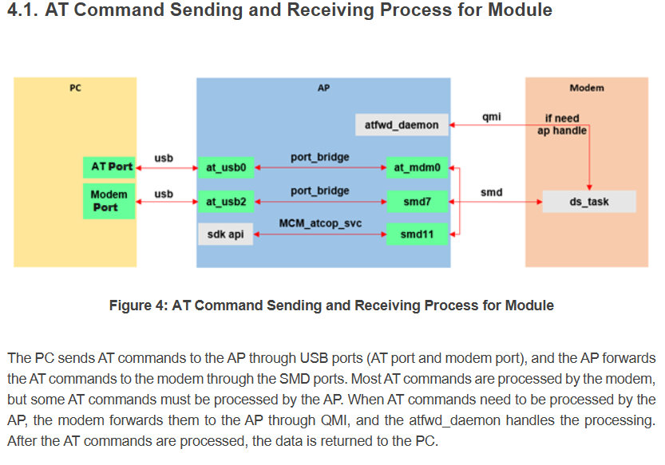

Quectel Modem Wiki
=================================
> :book: This is a living Wiki. Changes may be made as more discoveries are made or more community software is made. If you feel like you have information to contribute to this wiki please open a pull request.

# Advanced system diving on SDXLEMUR

Over the course of poking and prodding, many things were discovered. This will serve as a place to preserve that knowledge.

# Simple AT Commands

So, a simple way to send/receive commands.. open two adb shell sessions to the modem, in one, run `cat /dev/smd7`. In the other, you run the AT commands. Example:

Listening shell:
```
/ # cat /dev/smd11
AT
OK
ATI
Quectel
RM520N-GL
Revision: RM520NGLAAR01A07M4G

OK
```

Command shell:
```
/tmp # echo -e 'AT \r' > /dev/smd11
/tmp # echo -e 'ATI \r' > /dev/smd11
```

See the diagram for more info on this:



As you can see in the diagram above, 2 serial ports are exposed to the host over USB. Both can be used to send AT commands. The smd11 device is not linked to anything by default, and is meant for use with the API included in their QuecOpen SDK.

## Enabling IP Passthrough

If you want to turn on IP passthrough where the IP address assigned form the cell carrier passes to what connects to the ethernet port, you can! The LAN IP addresses including the gateway are still accessible even while IPPT  (IP Passthrough) is enabled.

**There are 3 stages of IP Passthrough:** 
### DMZ Method
This method is not technically a true IP Passthrough, however it effectively gets rid of the double NAT as well. Basically what you are doing here is limiting your DHCP to assign only 1 IP address  and then setting that as the DMZ, effectivity port forwarding every port to that internal IP.

#### To enable IP passthrough (DMZ Method):
```
AT+QMAP="LAN",192.168.225.2
AT+QMAP="DMZ",1,4,192.168.225.2
AT+CFUN=1,1 (reboot)
```
If the "LAN" command doesn't work then use "LANIP" to define the start range, end range, gateway,1
Make start and end range the same

### Actual IP Passthrough

This is the method that is documented on page 231 of the  [ 2023-07-31 AT Manual](https://github.com/iamromulan/RM520N-GL/blob/main/Documents/Quectel_RG520N&RG525F&RG5x0F&RM5x0N_Series_AT_Commands_Manual_V1.0.0_Preliminary_20230731.pdf)

#### To enable IP passthrough (QMAP Method):
```
AT+QMAP="MPDN_rule",0,1,0,1,1,"FF:FF:FF:FF:FF:FF"
```

As soon as you send this command the Ethernet port should shut off for a second or 2 then come back up with IPV4 passthrough. Note: IPV6 assigns sometimes too? Was it just the DHCP IPV6? I'll look into this.

##### MPDN rule parameters:
* First = MPDN rule number, range 0-3 (unless you're doing something complicated, you'll use 0.) [Hint: Multiple data call rules]
* Second = APN Profile ID (CGDCONT) to use. You'll probably want 1.
* Third = VLAN ID. This is typically 0 but you can run `AT+QMAP="VLAN"` to find out what it should be.
* Fourth = IPPT mode, use 1 for ethernet use 0 for disable (more modes in the AT PDF)
* Fifth = Auto Connect. If set to 0=disabled 1=enabled 
* Sixth = MAC address to pass through to. `FF:FF:FF:FF:FF:FF` will pass the IP to the last connected ethernet device. `”00:00:00:00:00:00”` will pass only to the first connected ethernet device. You can also specify a custom mac address instead. 
##### DHCPV4DNS
Turns the IPV4 DNS proxy on and off so the DNS from the carrier will passthrough as well.
So...
Internally there's a DNS server/proxy for setting the domain name by AT command and having it actually work. There's a way by adb shell/ssh shell to set a DNS override yourself to nameservers of your own. Tailscale does this on its own which I will talk about later.
```
AT+QMAP="DHCPV4DNS","disable"
```
#### To disable IP passthrough (QMAP Method):
```
AT+QMAP="MPDN_rule",0 (Ethernet port will shutoff and come back up)
AT+QMAPWAC=1 (if not in ECM mode)
AT+CFUN=1,1 (reboot)(optional)
```
OR

flash firmware

# Changing modem IP adresses

By default, the modem acts as a true NAT router for IPv4, and serves addresses via IPv6. The modem's IPv4 address is 192.168.225.1 - this CAN be changed via AT commands [See page 228: AT+QMAP="LANIP"](https://mega.nz/file/zEEmCYTb#Y_YVlSEWNn9tz9dpHvY1rSZuDR_gEB6XEVIQ0nGrCJQ)

There are plenty of reasons that you might need to change the IP of the modem.. IE, you might have multiple modems connected to the same router for WAN load balancing or bonding, or it might conflict with your internal network IP ranges, or (other reasons.) On recent firmware revisions a command can do this!

The command is:
```
AT+QMAP="LANIP",<dhcp-start>,<dhcp-end>,<router-ip>,<apply?>
AT+QMAP="LANIP",192.168.227.20,192.168.227.100,192.168.227.1,1
```

The 'apply?' is if the router should apply the changes immediately, or wait until reboot. 1 is yes 0 is no.

## Changing modem IP address by shell

This is mostly useful for the [RM521F-FL](./RM521F-GL) as it's firmware was never fully completed. I plan to experiment with using the sysfs.ubi from the [RM520N-GL](./RM520N-GL) firmware when I have time to see if things are fixed. 

There are plenty of reasons that you might need to change the IP of the modem.. IE, you might have multiple modems connected to the same router for WAN load balancing or bonding, or it might conflict with your internal network IP ranges, or (other reasons.) Unfortunately, Quectel doesn't officially support this, and there is no AT command to do so. However, it's not hard to do.

Make sure you've gained ADB access as described above.

1. Log into the modem via `adb shell` (If you have multiple modems connected via USB that have ADB enabled, you can get a list of modems with `adb devices`, and connect to the one you want via `adb -s <number> shell`)
2. Change to the `/etc` directory
3. Open `/etc/data/mobileap_cfg.xml` in an editor, and change each occurrence of 192.168.225 to whatever you want - for mine, I just went to 192.168.226.
4. Exit ADB, and reboot the router with `AT+CFUN=1,1`

Note that the 192.168.225.1 address is also referenced in `/etc/ql_nf_preload.conf`; I haven't modified that file and everything seems to work, but just so ya know.

## Enable Qualcomm Webserver
> :warning: Do not use this and Simpleadmin. Use either one or the other

> :bowtie: This section was contributed by [GitHub user aesthernr](https://github.com/aesthernr). Thanks for the contribution!

This is more of an honorable mention if you are curious. The QCMAP Web UI does not work quite right.

Qualcomm provides their OEMs with a tool called QCMAP, which is used to manage the WAN connection, modem IP configuration, etc. They also provide a simple web interface that is supposed to be able to manage some features of the modem. On RM500Q's, it was enable by default, but didn't actually work. The pieces for it are present on the RM520, and it does work, it just needs some work to enable it!

- Mount the root filesystem read-write:

```bash
adb shell mount -o remount,rw /
```

- Push the files to the system:

```bash
cd /path/to/quectel-rgmii-configuration-notes/files
adb push qcmap_httpd.service /lib/systemd/system
adb push qcmap_web_client.service /lib/systemd/system
```

- Reset the username/password to admin/admin. You will be able to update this after first login.

```bash
adb push lighttpd.user /data/www
adb shell chown www-data:www-data /data/www/lighttpd.user
```

- Symlink the systemd unit, reload systemd, start the service, and remount root as ro again:

```bash
adb shell chmod +x /etc/initscripts/start_qcmap_httpd
adb shell chmod +x /etc/initscripts/start_qcmap_web_client_le
adb shell ln -s /lib/systemd/system/qcmap_httpd.service /lib/systemd/system/multi-user.target.wants/
adb shell ln -s /lib/systemd/system/qcmap_web_client.service /lib/systemd/system/multi-user.target.wants/
adb shell systemctl daemon-reload
adb shell systemctl start qcmap_httpd
adb shell systemctl start qcmap_web_client
adb shell mount -o remount,ro /
```

- Open your Browser to [http://192.168.225.1/QCMAP.html](http://192.168.225.1/QCMAP.html) (replace the IP if necessary) - you can authenicate as admin/admin. It will prompt you to change your password after login. Note that WLAN settings will not do anything unless you have a supported wireless card connected via PCIe; that is out of scope for this document. It's also unknown if all the other functions will work as expected - however, a factory reset should wipe out all of these settings.

## Enable journald logging

By default, journald is masked on the modem - IE, nothing systemd does will end up having persistent logs. To fix this, we need to manually modify files in the root filesystem, as /etc isn't available at the point this is started.

Before enabling, I would recommend modifying /lib/systemd/journald.conf.d/00-systemd-conf.conf with some tweaks to prevent it from using lots of space:

```bash
adb shell mount -o remount,rw /
adb shell
# vi /lib/systemd/journald.conf.d/00-systemd-conf.conf
###edit params as below, and then save changes, and exit the shell###
adb shell mount -o remount,ro /
```

The config file by default has:

```bash
[Journal]
ForwardToSyslog=yes
RuntimeMaxUse=64M
```

I would recommend:

```bash
[Journal]
ForwardToSyslog=no
RuntimeMaxUse=16M
Storage=volatile
# Lots of spammy units, so limit the logging bursts.
RateLimitIntervalSec=5m
RateLimitBurst=100
```

This disables forwarding to the syslog daemon (to avoid taking up space twice), forces runtime (RAM) storage, and limits it to 16mb. It also enables fairly aggressive rate limiting, so that apps like ipacm won't force constant rotation.  (Each service gets its own rate limit.)

Here's how to enable the service:

```bash
adb shell mount -o remount,rw /
adb shell rm /lib/systemd/system/sysinit.target.wants/systemd-journald.service /lib/systemd/system/sockets.target.wants/systemd-journald.socket /lib/systemd/system/sockets.target.wants/systemd-journald-dev-log.socket
adb shell ln -s /lib/systemd/system/systemd-journald.service /lib/systemd/system/sysinit.target.wants/systemd-journald.service
adb shell ln -s /lib/systemd/system/systemd-journald.socket /lib/systemd/system/sockets.target.wants/systemd-journald.socket
adb shell systemctl daemon-reload
adb shell systemctl start systemd-journald.socket systemd-journald.service systemd-journald-dev-log.socket
# Also, to avoid lots of junk about write perms on unit files.. if you push the systemd units from a windows box, you might need to clean this up more often!
adb shell chmod 644 /lib/systemd/system/*.service /lib/systemd/system/*.socket /lib/systemd/system/*.conf
adb shell chmod 644 /lib/systemd/system/dbus.service.d/dbus.conf /lib/systemd/system/systemrw.mount.d/systemrw.conf
adb shell mount -o remount,ro /
```

Then, we have to unmount the mounted /etc directory, and remove the underlying masking of journald. We'll need to reboot the system to get the real /etc back:

```bash
adb shell umount -l /etc
adb shell mount -o remount,rw /
adb shell rm /etc/systemd/system/systemd-journald.service
adb shell mount -o remount,ro /
adb shell sync
adb shell reboot -f
```

If you also want to enable audit logs, also do the following as part of the above:

```bash
adb shell rm /lib/systemd/system/sockets.target.wants/systemd-journald-audit.socket
adb shell ln -s /lib/systemd/system/systemd-journald-audit.socket /lib/systemd/system/sockets.target.wants/systemd-journald-audit.socket
```

I am leaving systemd-journal-flush disabled (masked), as we don't want to write the logging data to persistent storage. Well - if you do you can change the Storage to "persistent" in the config file, and also symlink the systemd-journal-flush to actually switch from volitile to persistent storage on bootup.


