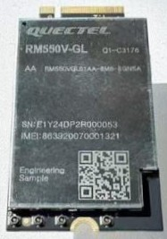

Quectel Modem Wiki
=================================
> :book: This is a living Wiki. Changes may be made as more discoveries are made or more community software is made. If you feel like you have information to contribute to this wiki please open a pull request.

# RM550V-GL

>:warning: The RM550V-GL is brand new and is currently in ES1 phase (Engineering Sample 1) 

The Quectel RM550V-GL is a cellular NR/LTE (5G/4G) M.2 B-Key modem module specially optimized for a variety of applications and usage scenarios utilizing the Qualcomm x72 platform.

You will find Tools, Docs, and Firmware for it here, as well as a .exe (QuecDeploy) that installs everything for windows.

# Table of Contents

- [Tech Specs](#tech-specs)
- [Where To Buy](#where-to-buy)
- [QuecDeploy](#quecdeploy)
- [Drivers, tools, AT Command PDFs, and firmware](#drivers-tools-at-command-pdfs-and-firmware)
- [Special Notes](#special-notes)
- [Related Pages](#related-pages)

# Tech Specs

*Its is likely this 550 module has a similar antenna layout to the 551*

# Where to Buy

Don't; the 551 is better, similar in price, and has far more attention and development from Quectel 
# QuecDeploy:

QuecDeploy installs/downloads drivers/tools/firmware quickly on Windows!

**[QuecDeploy DOWNLOAD](https://github.com/iamromulan/QuecDeploy/releases)**

A Linux version is planned, for now check out the [Mega Public Directory](https://mega.nz/folder/CRFWlIpQ#grOByBgkfZe5uLMkX2M2XA)

If you would prefer to simply explore all of the downloads I can give you; take a look at my [Mega Public Directory](https://mega.nz/folder/CRFWlIpQ#grOByBgkfZe5uLMkX2M2XA)

# Drivers, tools, AT Command PDFs, and firmware:

Use **[QuecDeploy](https://github.com/iamromulan/QuecDeploy/releases)** or browse my [Mega Public Folder](https://mega.nz/folder/CRFWlIpQ#grOByBgkfZe5uLMkX2M2XA) to get anything you need.

# Special Notes

- For this module to be recognized over USB it must power on by USB initially. Additional power may be provided after. 
- This modules comes in 2 versions. AA and AB. It appears the newer version is AB and the older is AA. It is posable to flash an AA with AB firmware but you will have a CFUN 7 error EFS mismatch. It is likely an xqcn restore from an AB to the target AA would solve this. I do not know what the difference between the 2 versions are.
- In an effort to bring firmware development progress from the [RM551E-GL](./RM550V-GL.md) over to the RM550V-GL, I went ahead and created a custom firmware for both AA and AB (AB is untested) versions. This custom firmware keeps the NON-HLOS image from the normal firmware while the rest is from [RM551E-GL](./RM550V-GL.md) firmware. As a result, my goal of getting PCIe RC mode working was achieved! This firmware can be obtained through  **[QuecDeploy](https://github.com/iamromulan/QuecDeploy/releases)** or from my [Mega Public Folder](https://mega.nz/folder/CRFWlIpQ#grOByBgkfZe5uLMkX2M2XA)
# Related Pages

[How to Flash Firmware on Windows](../flash_firmware_windows.md)
[Sending AT Commands](../qnavagator_guide.md)
[Quectel M.2 Modem Form Factor Features](../m.2_formfactors.md)
[Understanding MBN Profiles](../mbn_profiles.md)