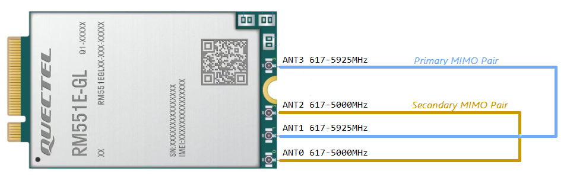
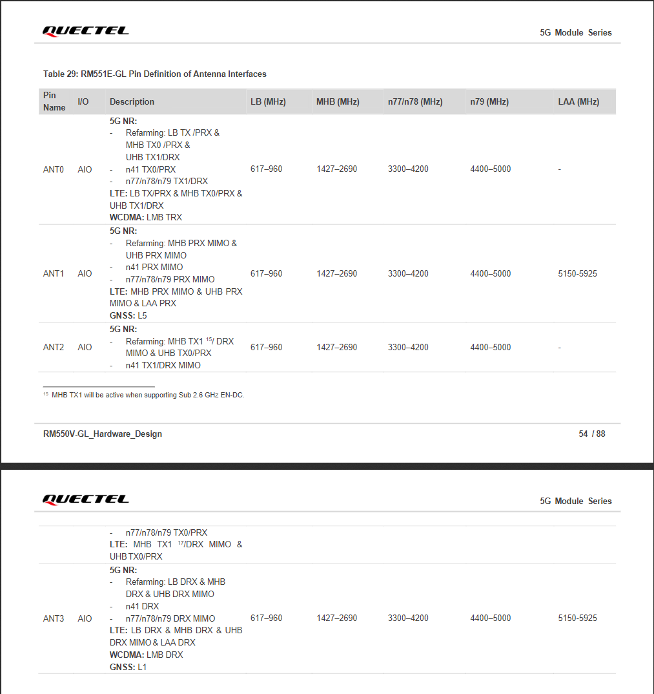

Quectel Modem Wiki
=================================
> :book: This is a living Wiki. Changes may be made as more discoveries are made or more community software is made. If you feel like you have information to contribute to this wiki please open a pull request.

# RM551E-GL

>:warning: The RM551E-GL is brand new and is currently in ES1 phase (Engineering Sample 1) 
>My modem the the above picture, if you read the SN: E1 (ES1) Y24 (2024), D64 (Unknown), Unit 9 (Modem #9)

The Quectel RM551E-GL is a cellular NR/LTE (5G/4G) M.2 B-Key modem module specially optimized for a variety of applications and usage scenarios utilizing the Qualcomm x75 platform.

# Table of Contents

- [Tech Specs](#tech-specs)
- [Where To Buy](#where-to-buy)
- [QuecDeploy](#quecdeploy)
- [Drivers, tools, AT Command PDFs, and firmware](#drivers-tools-at-command-pdfs-and-firmware)
- [Special Notes](#special-notes)
- [Related Pages](#related-pages)

# Tech Specs

# QuecDeploy:

QuecDeploy installs/downloads drivers/tools/firmware quickly on Windows!

**[QuecDeploy DOWNLOAD](https://github.com/iamromulan/QuecDeploy/releases)**

A Linux version is planned, for now check out the [Mega Public Directory](https://mega.nz/folder/CRFWlIpQ#grOByBgkfZe5uLMkX2M2XA)

If you would prefer to simply explore all of the downloads I can give you; take a look at my [Mega Public Directory](https://mega.nz/folder/CRFWlIpQ#grOByBgkfZe5uLMkX2M2XA)

# Drivers, tools, AT Command PDFs, and firmware:

Use **[QuecDeploy](https://github.com/iamromulan/QuecDeploy/releases)** or browse my [Mega Public Folder](https://mega.nz/folder/CRFWlIpQ#grOByBgkfZe5uLMkX2M2XA) to get anything you need.

# Special Notes

- For this module to be recognized over USB it must power on by USB initially. Additional power may be provided after. 
- I have created a custom firmware for this modem meant for usage in an AP mode (see the [M.2 Form Factor page](../m.2_formfactor.md))
# Related Pages

[How to Flash Firmware on Windows](../flash_firmware_windows.md)
[Sending AT Commands](../qnavagator_guide.md)
[Quectel M.2 Modem Form Factor Features](../m.2_formfactors.md)
[Understanding MBN Profiles](../mbn_profiles.md)