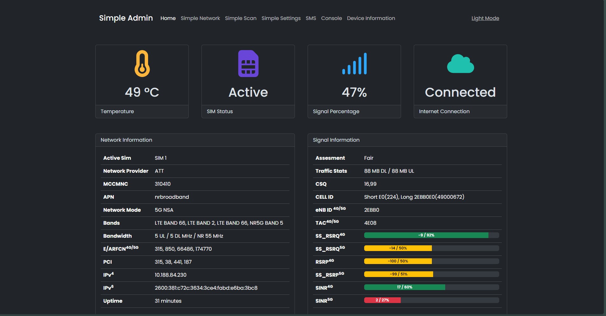
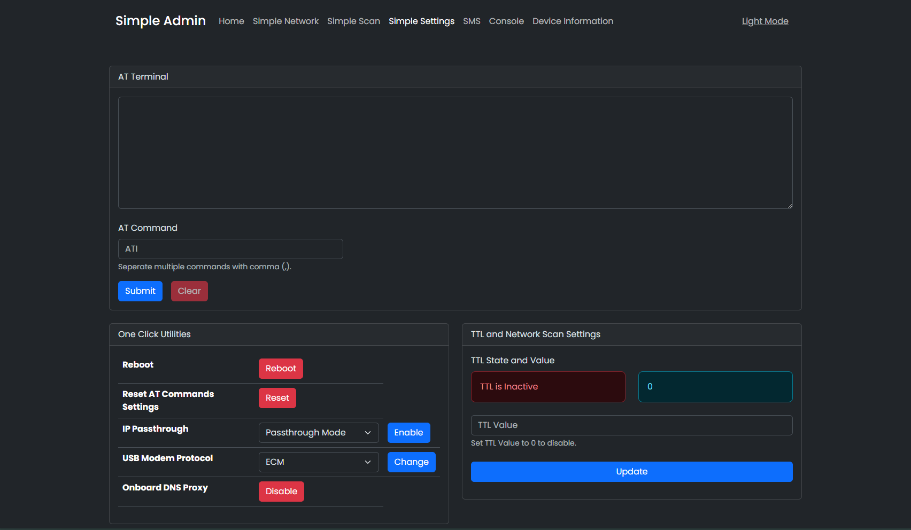
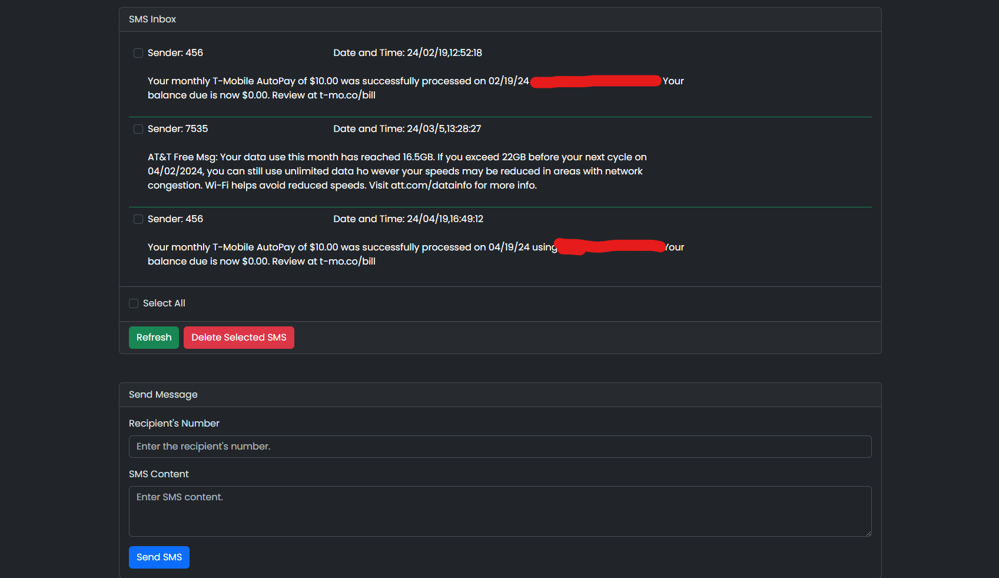
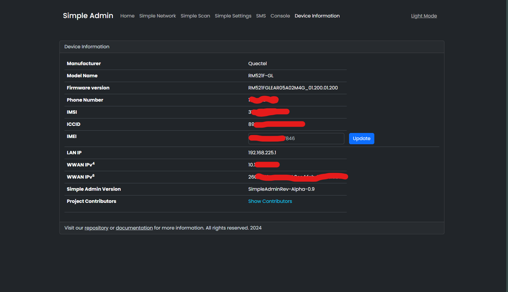

Quectel Modem Wiki
=================================
> :warning: This is a living document. Changes may be made as more discoveries are made or more community software is made. If you feel like you have information to contribute to this wiki please open a pull request.

# SDXPINN Direct M.2 Modem to Ethernet Guide

Many of Quectel's modems support directly connecting to a PCIe Ethernet chipset. This is useful to use the cellular connection as a WAN interface - you can just plug the modem into the WAN port on your router, do a bit of configuration, and you're good to go. Performance is good, and the modem's onboard connection management often works better than the scripts many routers use to try to keep the connection up.

# Table of Contents


- [Hardware Recommendations](#hardware-recommendations) 
  - [Proper Assembly](#proper-assembly)
  - [Recommended 12v 5A power supply](#recommended-12v-5a-power-supply)
  - [Other Known M.2 to RJ45 PCBs](#other-known-m.2-to-rj45-pcbs)
  - [Outdoor antenna enclosure combo setups](#outdoor-antenna-enclosure-combo-setups)

- [Modem Resource Repository](#rm520-resource-repository)
  
 - [Basic configuration](#basic-configuration)
   - [First Time Setup](#first-time-setup)
   - [After a firmware Flash; After first time setup](#after-a-firmware-flash-after-first-time-setup)
   - [Changing modem IP address with AT command](#changing-modem-ip-address-with-at-command)
   - [Enabling IP Passthrough](#enabling-ip-passthrough)
     - [DMZ Method](#dmz-method)
     - [Actual IP Passthrough](#actual-ip-passthrough)
     - [Disable NAT to VLAN in IPPT mode](#disable-nat-to-vlan)
     
  
- [Advanced configuration](#advanced-configuration)
  - [Unlocking and Using ADB](#unlocking-and-using-adb)
    - [Using ADB](#using-adb)
    - [Basic Commands](#basic-commands)
 - [Web GUI and Toolkit](#web-gui-and-toolkit)  
    - [Overview](#overview)
    - [How to install](#how-to-install)
    - [Tailscale Installation and Config](#tailscale-installation-and-config)
    -  [Enable Daily Reboot](#enable-daily-reboot)
    - [How to uninstall](#how-to-uninstall)
- [Other interesting things to check over ADB](#other-interesting-things-to-check-over-adb)
  - [Starting an FTP server](#starting-an-ftp-server)
   - [Changing modem IP address by adb shell](#changing-modem-ip-address-by-adb-shell)
   - [TTL Modification](#ttl-modification)
    - [Installing TTL Override:](#installing-ttl-override)
    - [Removing TTL Override](#removing-ttl-override)
  - [Enable Qualcomm Webserver](#enable-qualcomm-webserver)
  - [Enable journald logging](#enable-journald-logging)
  - [Making sure you're connected to the right modem](#making-sure-youre-connected-to-the-right-modem)
  - [AT Command Access from ADB](#at-command-access-from-adb)

# Hardware Recommendations


Essentially what we are doing is placing the modem in PCIe Root Complex mode so it can utilize an ethernet chipset via PCIe. You will need a board that has an M.2 B-Key slot with Power, Ethernet, SIM slot(s), and USB on it along with a way to provide the modems 4 MHF4 connectors with the cell signal.
## Indoor

**Here's the hardware I recommend for an indoor or on the go scenario:**


**Purchase Links:**

Without modem:
[Dual-Q 5G2PHY](https://rework.network/collections/lte-home-gateway/products/5g2phy)

**OR**

With x62 RM520N-GL (AP version modified/converted to normal AA).
Custom Arixolink firmware pre-flashed (Flash latest stock firmware if you want Simpleadmin 2.0 instead)
[Dual-Q 5G2PHY-RM520](https://www.rework.network/collections/lte-home-gateway/products/5g2phy-rm520)

**Includes:**
- Board and Case

- 40cm USB3.0 A Micro B Cable

- 2x 10cm MHF4 to SMA cable.

- 2x 15cm MHF4 to SMA cable.

- 1x 3x3.5x0.15 Silicone pad

- 1x 3x3x0.02 Silicone pad

- Mounting Hardware
- Small Heatsink for the onboard RTL8125 chipset

**Does not include**
- Power adapter
- Passive PoE injector/adapter
- Antennae

**Key Features:** 

- 2.5 Gigabit RTL8125 single RJ45 port
- **Passive PoE supported**, I use a 24v passive injector 
  - :warning: **Active PoE like 802.11 will not work** :warning: as it does not negotiate
- USB 3.0
- 5.5x2.5mm DC port accepts a wide voltage range of 12-50V
- The built in thick aluminum heatsink is placed underneath the modem and extends under the board itself, keeping it nice and cool even under heavy load.
- The placement of the M.2 slot near the very edge of the board allows easy access to the contact points on the back of the modem in case you need to get it into EDL mode.

## Outdoor

(Work in Progress)
Just a link for now :smile::
https://www.rework.network/collections/lte-home-gateway/products/5g-rgm-o

## Recommended Accessories

- DC adapter: [12v 5A one from Amazon](https://www.amazon.com/gp/product/B01GEA8PQA/ref=ppx_yo_dt_b_search_asin_title?ie=UTF8&psc=1)

- Passive PoE: The one included with the outdoor antenna is best but any  adapter with a voltage between 19 and 60v should be fine

- [MicroB to USB C converter 2-Pack](https://www.amazon.com/gp/product/B09LS3728B/ref=ppx_yo_dt_b_search_asin_title?ie=UTF8&psc=1)

- Indoor antennae [4 Pack from Amazon](https://www.amazon.com/dp/B0C58V4Y3B/ref=sspa_dk_detail_1?psc=1&pd_rd_i=B0C58V4Y3B&pd_rd_w=0g4A7&content-id=amzn1.sym.f2f1cf8f-cab4-44dc-82ba-0ca811fb90cc&pf_rd_p=f2f1cf8f-cab4-44dc-82ba-0ca811fb90cc&pf_rd_r=QSXJ1GHVACPJ42PEANDH&pd_rd_wg=9Y5yj&pd_rd_r=5f2a8db9-81a5-4f3a-97b4-654548e56cbf&s=aht&sp_csd=d2lkZ2V0TmFtZT1zcF9kZXRhaWxfdGhlbWF0aWM) (Untested; pick what you like)

- Home WiFi router: [GL.iNet Flint 2](https://www.amazon.com/GL-iNet-GL-MT6000-Multi-Gig-Connectivity-WireGuard/dp/B0CP7S3117?pd_rd_w=lAXSz&content-id=amzn1.sym.59910fa8-b73c-408a-aa5f-d0b4e0aa42cb&pf_rd_p=59910fa8-b73c-408a-aa5f-d0b4e0aa42cb&pf_rd_r=J8P5E4BQEY676GT05NP3&pd_rd_wg=QQO8w&pd_rd_r=f3fae9ae-ab4a-45d1-97bf-e43d119674bf&pd_rd_i=B0CP7S3117&psc=1&ref_=pd_bap_d_grid_rp_0_1_ec_nped_pd_rhf_cr_s_rp_c_d_sccl_1_2_t)

## Example Builds:

### Stationary

#### [GL.iNet Flint 2 Router](https://www.amazon.com/dp/B0CP7S3117?ref=ppx_yo2ov_dt_b_fed_asin_title) plus [Indoor Modem](#indoor)

### To-Go

#### [Beryl AX](https://www.amazon.com/GL-iNet-GL-MT3000-Pocket-Sized-Wireless-Gigabit/dp/B0BPSGJN7T/ref=pd_dp_d_dp_dealz_related_hxwDSD_sspa_dk_detail_d_sccl_1_4/143-6202989-9416117?pd_rd_w=gyXrF&content-id=amzn1.sym.718c0e9e-df60-4a61-87d8-27ff0362dee1&pf_rd_p=718c0e9e-df60-4a61-87d8-27ff0362dee1&pf_rd_r=717MSS1MXJGNVW36931C&pd_rd_wg=vCfwG&pd_rd_r=69dba604-feb1-4a18-9faa-fae36dbd6813&pd_rd_i=B0BPSGJN7T&psc=1&sp_csd=d2lkZ2V0TmFtZT1zcF9kZXRhaWxfdGhlbWF0aWM=) plus [Indoor Modem](#indoor)

- [Indoor Modem](#indoor)

- Travel WiFi Router: [GL.iNet Beryl AX](https://www.amazon.com/GL-iNet-GL-MT3000-Pocket-Sized-Wireless-Gigabit/dp/B0BPSGJN7T/ref=pd_dp_d_dp_dealz_related_hxwDSD_sspa_dk_detail_d_sccl_1_4/143-6202989-9416117?pd_rd_w=gyXrF&content-id=amzn1.sym.718c0e9e-df60-4a61-87d8-27ff0362dee1&pf_rd_p=718c0e9e-df60-4a61-87d8-27ff0362dee1&pf_rd_r=717MSS1MXJGNVW36931C&pd_rd_wg=vCfwG&pd_rd_r=69dba604-feb1-4a18-9faa-fae36dbd6813&pd_rd_i=B0BPSGJN7T&psc=1&sp_csd=d2lkZ2V0TmFtZT1zcF9kZXRhaWxfdGhlbWF0aWM=)
  - Rubber bands or zip ties :trollface:
  - [Short USBC to A cable](https://www.amazon.com/etguuds-Charging-Charger-Braided-Compatible/dp/B08933P982/ref=sr_1_3?crid=J131ZX2M386O&dib=eyJ2IjoiMSJ9.GywjpYp2bc5-8SJISwTc6W3kwgchqqXWTqo1Fo1FAXDa7-ieJoPDahrWkyWIC758tSzKuE3xykGy2XwQxcMk6IEHljpIgOvSpUME-TlAuGkmYSmTu01wFvSUN51DnWZRnKFiFQH8DpxEVZWLL6WRZXGvzUVdrOzs3vcKwnUn01DvZ9OvjfCyoxBFuLhveA0EqhQqz4LkotsyZqbp7-fQbgRAQdqvlXsRVJb7-038TVg.e31Plwf8cD1vndpIeQazjeQWFrPOC_vuTjInix2aobg&dib_tag=se&keywords=USBC+to+A+short&qid=1732753798&sprefix=usbc+to+a+shor%2Caps%2C197&sr=8-3)
  - [This Battery](https://www.amazon.com/gp/product/B0CQNQ7K8K/ref=ppx_yo_dt_b_search_asin_title?ie=UTF8&psc=1) 12v3A DC out, USB 5v3A out with passthrough charging

  - [5.5x2.1mm DC to 5.5x2.5mm DC adapter](https://www.amazon.com/gp/product/B07YWQ9N5S/ref=ppx_yo_dt_b_search_asin_title?ie=UTF8&psc=1)
 
 Result: 


# QuecDeploy and modem resources 
It is recommended that you check out my  **[RM520N-GL Resource Repository](https://github.com/iamromulan/RM520N-GL)**

There's an autoinstaller .cmd that will get you everything you need for windows installed and put in the right spots. Checkout the C:/Quectel/firmware folder for the firmware after using the .cmd

There's also a [Firmware Flashing Guide](https://github.com/iamromulan/RM520N-GL/tree/main#how-to-install-firmware-with-qflash-windows-) for Windows there 

There's also a [AT Commands from Windows Guide](https://github.com/iamromulan/RM520N-GL#how-to-use-qnavigator-to-send-at-commands)


# Basic configuration


It is recommended to Flash the latest firmware available before continuing. 

Check out my [RM520 Resource Repository](#RM520-Resource-Repository) 

> Remember:

A fresh flash will do the following:  

 - IPPT for both methods will be turned off back to default  
 - AT+QMAPWAC=1 will go back to AT+QMAPWAC=0 turning off autoconnect
 Send AT+QMAPWAC=1 and reboot to fix this. You can also do it through adb if you previously unlocked and enabled it like this:
 
```
adb shell "echo -e 'AT+QMAPWAC=1 \r' > /dev/smd7"
adb shell reboot
```

 - Custom software/services installed by/through adb shell will be removed. You can reinstall the Telnet Daemon, Simple Admin, and Daily reboot [with my Combo Installer](https://github.com/iamromulan/quectel-rgmii-simpleadmin-at-telnet-daemon)
 
 ## First Time Setup
Connect to the modem by USB and run these AT Commands in Qnavigator. If you don't have Qnavigator or another way to send AT Commands check out my [RM520 Resource Repository](#RM520-Resource-Repository) 
```
AT+QCFG="data_interface",0,0
AT+QETH="eth_driver","r8125",1
AT+QCFG="pcie/mode",1
AT+QCFG="usbnet",1  #[if you need to be in a different USB mode for whatever reason remember to send AT+QMAPWAC=1]
AT+QMAPWAC=1  #[optional if in ECM mode, as this will happen on its own anyways.]
AT+CGDCONT=1,"IPV4V6","apn-here-inside-of-quotes"
Any other *magic* commands you want to run for proper cellular connection
AT+QPRTPARA=1 [optional]
AT+CFUN=1,1
```

What these commands do:
* `AT+QCFG="data_interface"`: Configures network port/diag port communication via PCIe and USB. First parameter is for network communication; 0 is USB and 1 is PCIe. Second parameter is for diagnostics port; only option is 0 for USB. Note that even when in PCIe mode for network, the USB port is still available for a connection. It seems that the modem will request a second IP address from the carrier using a different APN profile. There's a command though that's supposed to enable using the same APN on page 41/42 of the 07-31-2023 AT Doc in the [RM520N-GL Resource Repository](https://github.com/iamromulan/RM520N-GL) This *should* all work of course if your cell carrier will allow a second IP to be assigned to the SIM/LINE. I will have to play with this more.
*  `AT+QETH="eth_driver","r8125",1`: This configures which ethernet driver to load at module boot. This is the correct driver for the RTL8125 ethernet chipset. You can run `AT+QETH="eth_driver"` to get a list of options; I believe only one can be enabled. The first parameter is the name of the driver, and the second parameter is a bool to enable or disable.
* `AT+QCFG="pcie/mode"`: 1 = RC (Root Complex), IE host. 0 = EP (Endpoint), for use in a device that has the RC
*  `AT+QCFG="usbnet",1`: NIC data call method in USB ECM mode. 1=ECM (Ethernet Control Model) Internally, even if there wasn't a physical ethernet port for it to use, the modem sets itself up to maintain the connection itself in this mode. Look into what ECM is to know why.
*  `AT+QMAPWAC`: enable or disable mobile AP auto dial: 0=disable 1=enable (reboot to take effect). You can run `AT+QMAPWAC?` to get what it is currently saved as/set to. My findings: Think of it as a universal auto connect setting. If its set to 0 the radio will connect (or does it?) so you can see signal stats, but will not get an IP address from the carrier. In most USB modes (except ECM) its up to the device it's connected to in order to finish that process. If you set it to 1, it will always request an IP after registering with the network.
*   `AT+CGDCONT`: Set APN command. Run `AT+CGDCONT` to see what APN profiles 1 through 8 are set to. To clear an APN just send = and the number of the profile you want to clear. For example, if i wanted to clear APN profile 1 I would send `AT+CGDCONT=1` To set an APN you specify the profile number, the protocol (IPV4, IPV6, or IPV4V6 for both) then the APN. For example if I wanted to set APN 1 as APNGOESHERE using both IPV4 and IPV6 i would send `AT+CGDCONT=1,"IPV4V6","APNGOESHERE"`
	* Note: Your APN will be auto filled either way based on the SIM and what the modems built in MDM profile knows about it. Sometimes you want to use a different APN than what it uses. Normally you can just manually set this by running the command and it will stick. In certain scenarios though like when you switch from SIM1 to SIM2 then back to SIM1 or vice versa, the APN will go back to the one in its MBN profile. Run `AT+CGDCONT?"` to find out. A script that locks an ICCID to an APN is on my hit list.
* `AT+QPRTPARA=1`: Supposed to save current config to memory. Not that you need to, but l always run it just in case.

..after running `AT+CFUN=1,1` the modem will reboot and you should get a local IP address assigned from the ethernet port.  192.168.225.x normally. 

## After a firmware Flash; After first time setup

### After a firmware Flash these commands need ran to get back online
#
#### If you are not in ECM mode (AT+QCFG="usbnet",1) then you need to do this first:
```
AT+QMAPWAC=1  
AT+CFUN=1,1 (or just reboot)
```
#

  #### Run my [ Toolkit](https://github.com/iamromulan/quectel-rgmii-toolkit) 
  A firmware flash removes what the toolkit does:
  -  Install Telnet Daemon
  - Install the Simpleadmin web interface
  - Install and configure Tailscale
  - Set a reboot timer if you want to
  - Send an AT command or 2 if you want


## Changing modem IP address with AT command
By default, the modem acts as a true NAT router for IPv4, and serves addresses via IPv6. The modem's IPv4 address is 192.168.225.1 - this CAN be changed via AT commands [See page 228: AT+QMAP="LANIP"](https://mega.nz/file/zEEmCYTb#Y_YVlSEWNn9tz9dpHvY1rSZuDR_gEB6XEVIQ0nGrCJQ)

There are plenty of reasons that you might need to change the IP of the modem.. IE, you might have multiple modems connected to the same router for WAN load balancing or bonding, or it might conflict with your internal network IP ranges, or (other reasons.) On recent firmware revisions a command can do this!

The command is:
```
AT+QMAP="LANIP",<dhcp-start>,<dhcp-end>,<router-ip>,<apply?>
AT+QMAP="LANIP",192.168.227.20,192.168.227.100,192.168.227.1,1
```

The 'apply?' is if the router should apply the changes immediately, or wait until reboot. 1 is yes 0 is no.


## Enabling IP Passthrough

If you want to turn on IP passthrough where the IP address assigned form the cell carrier passes to what connects to the ethernet port, you can! The LAN IP addresses including the gateway are still accessible even while IPPT  (IP Passthrough) is enabled.

**There are 3 stages of IP Passthrough:** 

#

### DMZ Method
This method is not technically a true IP Passthrough, however it effectively gets rid of the double NAT as well. Basically what you are doing here is limiting your DHCP to assign only 1 IP address  and then setting that as the DMZ, effectivity port forwarding every port to that internal IP.

#### To enable IP passthrough (DMZ Method):
```
AT+QMAP="LAN",192.168.225.2
AT+QMAP="DMZ",1,4,192.168.225.2
AT+CFUN=1,1 (reboot)
```
If the "LAN" command doesn't work then use "LANIP" to define the start range, end range, gateway,1
Make start and end range the same
#
### Actual IP Passthrough

This is the method that is documented on page 231 of the  [ 2023-07-31 AT Manual](https://github.com/iamromulan/RM520N-GL/blob/main/Documents/Quectel_RG520N&RG525F&RG5x0F&RM5x0N_Series_AT_Commands_Manual_V1.0.0_Preliminary_20230731.pdf)

#### To enable IP passthrough (QMAP Method):
```
AT+QMAP="MPDN_rule",0,1,0,1,1,"FF:FF:FF:FF:FF:FF"
```

As soon as you send this command the Ethernet port should shut off for a second or 2 then come back up with IPV4 passthrough. Note: IPV6 assigns sometimes too? Was it just the DHCP IPV6? I'll look into this.

##### MPDN rule parameters:
* First = MPDN rule number, range 0-3 (unless you're doing something complicated, you'll use 0.) [Hint: Multiple data call rules]
* Second = APN Profile ID (CGDCONT) to use. You'll probably want 1.
* Third = VLAN ID. This is typically 0 but you can run `AT+QMAP="VLAN"` to find out what it should be.
* Fourth = IPPT mode, use 1 for ethernet use 0 for disable (more modes in the AT PDF)
* Fifth = Auto Connect. If set to 0=disabled 1=enabled 
* Sixth = MAC address to pass through to. `FF:FF:FF:FF:FF:FF` will pass the IP to the last connected ethernet device. `”00:00:00:00:00:00”` will pass only to the first connected ethernet device. You can also specify a custom mac address instead. 
##### DHCPV4DNS
Turns the IPV4 DNS proxy on and off so the DNS from the carrier will passthrough as well.
So...
Internally there's a DNS server/proxy for setting the domain name by AT command and having it actually work. There's a way by adb shell/ssh shell to set a DNS override yourself to nameservers of your own. Tailscale does this on its own which I will talk about later.
```
AT+QMAP="DHCPV4DNS","disable"
```
#### To disable IP passthrough (QMAP Method):
```
AT+QMAP="MPDN_rule",0 (Ethernet port will shutoff and come back up)
AT+QMAPWAC=1 (if not in ECM mode)
AT+CFUN=1,1 (reboot)(optional)
```
OR

flash firmware---> follow [After a firmware Flash; After first time setup](#after-a-firmware-flash-after-first-time-setup)

### Disable NAT to VLAN
After enabling your MDPN rule with IPPT on, you can disable NAT to VLAN0 (192.168.225.x addresses and go full passthrough (I wouldn't recommended this though unless you don't need/want local access to the gateway) You should be able to use Tailscale to get to the gateway address still though.

# Advanced configuration

These modems are a full-fledged Linux router under the hood. Once you've got access, you can modify anything you want on the filesystem. It's pretty cool, and also kind of dangerous.. but neat. The access is via 'adb' - the same tool used to do fun stuff to Android phones. If you install Tailscale you can also use SSH over Tailscale. I'll talk more about that later.

## Unlocking and using ADB
By default, these modems do not have ADB over USB turned on, and they need to be unlocked to do so. Once this happens its unlocked unless you disable it.
#
> :bowtie: Thanks to [carp4](https://github.com/carp4) for their work on the [qadbkey-unlock python script](https://github.com/carp4/qadbkey-unlock) we can do this without Quectel's help now!

To get access, you need to get a lock code from the modem, then give that to the python ADB unlock keygen, take the unlock key code it gives you, unlock ADB, and then actually enable ADB over USB. This only needs to be done once, as this survives firmware flashing.
#
To get the lock code, run the AT command "AT+QADBKEY?". The modem will reply with:
```
AT+QADBKEY?
+QADBKEY: 12345678
OK
```
12345678 being the lock code in this case

You then can head over to [The Python ADB unlock key Generator](https://onecompiler.com/python/3znepjcsq)


**Replace the 12345678 with the response you got from running `AT+QADBKEY?`** then click run. Under output your unlock key will be generated.
#
Once you have received the unlock key, you apply the key like this:
```
AT+QADBKEY="0jXKXQwSwMxYoeg"
```

Then, to actually enable ADB, run `AT+QCFG="usbcfg"`, take the output, change the second-to-last 0 to 1, and then send the new usbcfg string to the modem (do _NOT_ just copy/paste what's below; the USB VID/PID for your modem are very likely different):

```control
AT+QCFG="usbcfg"
+QCFG: "usbcfg",0x2C7C,0x0801,1,1,1,1,1,0,0 // Initial response
AT+QCFG="usbcfg",0x2C7C,0x0801,1,1,1,1,1,1,0 // Enable ADB
```

And reboot with `AT+CFUN=1,1` to actually apply.

### Using ADB
:warning: To be restructured soon
:warning: adb is now insatlled with QFlash 7.1+ from QuecDeploy
:warning: Outdated

Once the modem is back online, you should be able to use ADB to manage the modem on the host connected to it with USB. You'll need to install the ADB drivers and the ADB command line tool before you can use it. The easiest way to do this is just to use my RM520 repo script. 
### Basic commands:
In a ADB & Fastboot++ type `adb devices` and press enter. If you have adb unlocked on your modem and it is connected by usb, you should have at least one device show up on the list. This is a good way to test if adb is installed and properly recognizing your modem or android phone. 
**Example:** 


- `adb pull /path/to/file` - download a file from the modem to the current working directory
- `adb push /path/on/computer /path/on/modem` - upload a file to the modem
- `adb shell` - remote control the root linux shell/command line on the modem, type exit when done (note that while in the shell any commands you want to run that normally begin with `adb shell`, that part needs to be be skipped)
  - In the adb shell of a Quectel modem it will behave like a unix shell. Commands like `uname -a` will show you the name of the OS, the processor type, build date info, and more; `ls` will show you the file structure, and `systemctl list-units --type=service --all` will show all services installed running or not.

So far, I have been unsuccessful with my attempts to get ADB to listen on the ethernet interface over IP. Warning the - `adb tcp <port>` command will crash both ADB and all the other serial ports exposed via USB until the modem is restarted. So stick with using ADB over USB for now. If anyone understands how adbd works on this device feel free to open an issue/discussion/PR. For now you can SSH over tailscale.
## Web GUI and Toolkit
:warning: To be restructured soon
### Overview
After gaining adb acess, you can install a simple web interface you'll be able to access using the modems gateway IP address. You can see some basic signal stats, send AT commands from the browser, and change your TTL directly on the modem. By default this will be on https on port 443 with a redirect from 80 to 443. So if you didn't change the gateway IP address you'd go to https://192.168.225.1/ (SDXLEMUR) and you'd find this...





Console:



^^^ Simple Admin 2.0 on the SDXLEMUR Branch ^^^
Thanks to the work of [dr-dolomite](github.com/dr-dolomite) we can install something like this! 

### How to install
- For the **RM500/502/520/521/530** (SDXLEMUR and SDXPRAIRIE platforms armv7 32-bit)
	- Use the [SDXLEMUR Branch](https://github.com/iamromulan/quectel-rgmii-toolkit/tree/SDXLEMUR) (to be renamed to SDXLEMUR soon) instead of main, it has the latest changes and is ready for general use. :)

- For the **RM550/551** (SDXPINN platform OpenWRT system armv8-A 64-bit)
	- Use the [SDXPINN Branch](https://github.com/iamromulan/quectel-rgmii-toolkit/tree/SDXPINN)

 

## Tailscale Installation and Config

> :warning: Your modem must already be connected to the internet for this to install
### Installation:
Open up the toolkit main menu and press 4 to enter the Tailscale menu

**Press 1, wait for it to install. This is a very large file for the system so give it some time. Once done and it says tailscaled is started press 2 to configure it.**


First time connecting you'll be given a link to login with
 - Press 1 to just connect only.
 - Press 2 to connect and enable SSH access (remote command line) over tailscale.
 - Press 3 to reconnect with SSH off while connected with SSH on
 - Press 4 to disconnect
 - Press 5 to Logout

**Important**

**You will want to go to your Tailscale DNS settings at https://login.tailscale.com/admin/dns and turn on Override local DNS and add a DNS provider to avoid loosing internet connectivity on your modem.** 

This happens because the Tailscale binary creates  `/etc/reslov.conf` to override the modems DNS to use the one from your Tailnet instead. If you don't have a public DNS you won't be able to use the internet. I use Cloudflare and Google. I will add an option to the Toolkit to connect with DNS off later, its on the hit list.

That's it! From another device running tailscale you should be able to access your modem through the IP assigned to it by your tailnet. To access SSH from another device on the tailnet, open a terminal/command prompt and type

    tailscale ssh root@(IP or Hostname)
IP or Hostname being the IP or hostname assigned to it in your tailnet

 - Note that your SSH client must be able to give you a link to sign in with upon connecting. That's how the session is authorized. Works fine in Windows CMD or on Android use JuiceSSH.


## Enable Daily Reboot
:warning: To be restructured soon
:warning: Outdated
> :warning: Your modem must already be connected to the internet for this to install

See the Modem AP Toolkit Project

### How to uninstall

See the Modem AP Toolkit Project


# Other interesting things to check over ADB
 :warning: To be restructured soon
:warning: Outdated

## Starting an FTP server

Once you have root access (adb) to the modem, if you want you can start a temporary FTP server to let you transfer files over the network instead of adb. It will run until you ctrl-c it. Be careful here, it allows full unauthenticated access to the filesystem to whoever can access any of the IPs (if you have a routed public IP, vi that too unless you add firewall rules!) You can change the IP to the modem's LAN address (192.168.225.1 by default) if you'd like.

```bash
tcpsvd -vE 0.0.0.0 21 ftpd /
```

When you connect via FTP, you can just leave the username and password blank.

Note that the BusyBox binary on the modem is compiled without FTP write support. If you would like to enable write support, you can copy files/busybox-armv7l somewhere on the modem (anything under /usrdata is persistent; for this example I created /usrdata/bin), and call that binary instead, with a '-w' flag between ftpd and /; I would also recommend using the current busybox for tcpsvd. You'll also need to add '-A' to ftpd for anonymous access. Example command:

```bash
/usrdata/bin/busybox-armv7l tcpsvd -xE 0.0.0.0 21 /usrdata/bin/busybox-armv7l ftpd -wA /
```

## Changing modem IP address by adb shell
:warning: To be restructured soon
:warning: Outdated
**NOTE**: I am leaving this here for reference sake, but on modern modems, you can indeed change the IP with an AT command. Please reference: [Changing modem IP address with AT command
](#changing-modem-ip-address-with-at-command)

There are plenty of reasons that you might need to change the IP of the modem.. IE, you might have multiple modems connected to the same router for WAN load balancing or bonding, or it might conflict with your internal network IP ranges, or (other reasons.) Unfortunately, Quectel doesn't officially support this, and there is no AT command to do so. However, it's not hard to do.

Make sure you've gained ADB access as described above.

WARNING: You're modifying files on the modem's root filesystem here. If you break it, you buy it, and can keep both pieces!

1. Log into the modem via `adb shell` (If you have multiple modems connected via USB that have ADB enabled, you can get a list of modems with `adb devices`, and connect to the one you want via `adb -s <number> shell`)
2. Change to the `/etc` directory
3. Open `/etc/data/mobileap_cfg.xml` in an editor, and change each occurence of 192.168.225 to whatever you want - for mine, I just went to 192.168.226.
4. Exit ADB, and reboot the router with `AT+CFUN=1,1`

Note that the 192.168.225.1 address is also referenced in `/etc/ql_nf_preload.conf`; I haven't modified that file and everything seems to work, but just so ya know.

## TTL Modification

> :warning: Do not use this at the same time as the Simpleadmin TTL mod. Use either one or the other
> :warning: To be restructured soon
:warning: Outdated

This is a Linux router using iptables - so you can add iptables rules to override the outgoing TTL. Certain cell plans may require this for various reasons.

It's probably worth noting that this will also work for modems connected via a USB enclosure.. what this does is directly change the TTL/HL when packets leave the modem, so it really doesn't matter how it's connected to your network.

Make sure you've gained ADB access as described above.

WARNING: You're modifying files on the modem's root filesystem here. If you break it, you buy it, and can keep both pieces!

Files:
* `files/ttl-override`: A simple shell script to start/stop the TTL override. Set the desired TTL with the 'TTLVALUE=' at the top of the script; the default is 64, which will make all packets appear as coming from the modem itself.
* `files/ttl-override.service`: A systemd service to start said script

### Installing TTL Override:

* Mount the root filesystem read-write:
```
adb shell mount -o remount,rw /
```
* Push the files to the system:
```
adb push ttl-override /etc/initscripts
adb push ttl-override.service /lib/systemd/system
```
* symlink the systemd unit, reload systemd, start the service, and remount root as ro again:
```
adb shell chmod +x /etc/initscripts/ttl-override
adb shell ln -s /lib/systemd/system/ttl-override.service /lib/systemd/system/multi-user.target.wants/
adb shell systemctl daemon-reload
adb shell systemctl start ttl-override
adb shell mount -o remount,ro /
```
* The TTL rules will already be active - but you can reboot the modem with `AT+CFUN=1,1` and verify that the rules are automatically added at startup.
* After it comes back up, you can verify the TTL:
```
$ adb shell iptables -t mangle -vnL | grep TTL
 1720  107K TTL        all  --  *      rmnet+  0.0.0.0/0            0.0.0.0/0            TTL set to 64
$ adb shell ip6tables -t mangle -vnL | grep HL
    0     0 HL         all      *      rmnet+  ::/0                 ::/0                 HL set to 64
```

If you want to validate that it's working, you can use "adb shell", and run tcpdump on the network-side interface, specifying that interface's IP as the source (feel free to do that instead of pasting my long ugly string):
```
/ # tcpdump -s0 -v -n -i rmnet_data1 src `ip addr show dev rmnet_data1 | grep '^    inet ' | awk '{ print $2 }' | awk -F'/' '{ print $1 }'`
tcpdump: listening on rmnet_data1, link-type LINUX_SLL (Linux cooked v1), capture size 65535 bytes
17:12:03.064808 IP (tos 0x0, ttl 64, id 55285, offset 0, flags [DF], proto ICMP (1), length 212)
    10.200.255.210 > 8.8.4.4: ICMP echo request, id 16940, seq 2, length 192
```

Note the "ttl 64" - it's working, yay! (The traffic needs to be coming from a host behind the modem for it to really count, which this was.)

### Removing TTL Override

If, for some reason, you want to remove the TTL override, you would need to run:
```
adb shell /etc/initscripts/ttl-override stop
adb shell mount -o remount,rw /
adb shell rm -v /etc/initscripts/ttl-override /lib/systemd/system/ttl-override.service /lib/systemd/system/multi-user.target.wants/ttl-override.service
adb shell mount -o remount,ro /
adb shell systemctl daemon-reload
```
..no need to reboot.

## Enable Qualcomm Webserver
> :warning: Do not use this and the Simpleadmin. Use either one or the other

> :bowtie: This section was contributed by [GitHub user aesthernr](https://github.com/aesthernr). Thanks for the contribution!

:warning: To be restructured soon
:warning: Outdated

Qualcomm provides their OEMs with a tool called QCMAP, which is used to manage the WAN connection, modem IP configuration, etc. They also provide a simple web interface that is supposed to be able to manage some features of the modem. On RM500Q's, it was enable by default, but didn't actually work. The pieces for it are present on the RM520, and it does work, it just needs some work to enable it!

- Mount the root filesystem read-write:

```bash
adb shell mount -o remount,rw /
```

- Push the files to the system:

```bash
cd /path/to/quectel-rgmii-configuration-notes/files
adb push qcmap_httpd.service /lib/systemd/system
adb push qcmap_web_client.service /lib/systemd/system
```

- Reset the username/password to admin/admin. You will be able to update this after first login.

```bash
adb push lighttpd.user /data/www
adb shell chown www-data:www-data /data/www/lighttpd.user
```

- Symlink the systemd unit, reload systemd, start the service, and remount root as ro again:

```bash
adb shell chmod +x /etc/initscripts/start_qcmap_httpd
adb shell chmod +x /etc/initscripts/start_qcmap_web_client_le
adb shell ln -s /lib/systemd/system/qcmap_httpd.service /lib/systemd/system/multi-user.target.wants/
adb shell ln -s /lib/systemd/system/qcmap_web_client.service /lib/systemd/system/multi-user.target.wants/
adb shell systemctl daemon-reload
adb shell systemctl start qcmap_httpd
adb shell systemctl start qcmap_web_client
adb shell mount -o remount,ro /
```

- Open your Browser to [http://192.168.225.1/QCMAP.html](http://192.168.225.1/QCMAP.html) (replace the IP if necessary) - you can authenicate as admin/admin. It will prompt you to change your password after login. Note that WLAN settings will not do anything unless you have a supported wireless card connected via PCIe; that is out of scope for this document. It's also unknown if all the other functions will work as expected - however, a factory reset should wipe out all of these settings.

## Enable journald logging

By default, journald is masked on the modem - IE, nothing systemd does will end up having persistent logs. To fix this, we need to manually modify files in the root filesystem, as /etc isn't available at the point this is started.

Before enabling, I would recommend modifying /lib/systemd/journald.conf.d/00-systemd-conf.conf with some tweaks to prevent it from using lots of space:

```bash
adb shell mount -o remount,rw /
adb shell
# vi /lib/systemd/journald.conf.d/00-systemd-conf.conf
###edit params as below, and then save changes, and exit the shell###
adb shell mount -o remount,ro /
```

The config file by default has:

```bash
[Journal]
ForwardToSyslog=yes
RuntimeMaxUse=64M
```

I would recommend:

```bash
[Journal]
ForwardToSyslog=no
RuntimeMaxUse=16M
Storage=volatile
# Lots of spammy units, so limit the logging bursts.
RateLimitIntervalSec=5m
RateLimitBurst=100
```

This disables forwarding to the syslog daemon (to avoid taking up space twice), forces runtime (RAM) storage, and limits it to 16mb. It also enables fairly aggressive rate limiting, so that apps like ipacm won't force constant rotation.  (Each service gets its own rate limit.)

Here's how to enable the service:

```bash
adb shell mount -o remount,rw /
adb shell rm /lib/systemd/system/sysinit.target.wants/systemd-journald.service /lib/systemd/system/sockets.target.wants/systemd-journald.socket /lib/systemd/system/sockets.target.wants/systemd-journald-dev-log.socket
adb shell ln -s /lib/systemd/system/systemd-journald.service /lib/systemd/system/sysinit.target.wants/systemd-journald.service
adb shell ln -s /lib/systemd/system/systemd-journald.socket /lib/systemd/system/sockets.target.wants/systemd-journald.socket
adb shell systemctl daemon-reload
adb shell systemctl start systemd-journald.socket systemd-journald.service systemd-journald-dev-log.socket
# Also, to avoid lots of junk about write perms on unit files.. if you push the systemd units from a windows box, you might need to clean this up more often!
adb shell chmod 644 /lib/systemd/system/*.service /lib/systemd/system/*.socket /lib/systemd/system/*.conf
adb shell chmod 644 /lib/systemd/system/dbus.service.d/dbus.conf /lib/systemd/system/systemrw.mount.d/systemrw.conf
adb shell mount -o remount,ro /
```

Then, we have to unmount the mounted /etc directory, and remove the underlying masking of journald. We'll need to reboot the system to get the real /etc back:

```bash
adb shell umount -l /etc
adb shell mount -o remount,rw /
adb shell rm /etc/systemd/system/systemd-journald.service
adb shell mount -o remount,ro /
adb shell sync
adb shell reboot -f
```

If you also want to enable audit logs, also do the following as part of the above:

```bash
adb shell rm /lib/systemd/system/sockets.target.wants/systemd-journald-audit.socket
adb shell ln -s /lib/systemd/system/systemd-journald-audit.socket /lib/systemd/system/sockets.target.wants/systemd-journald-audit.socket
```

I am leaving systemd-journal-flush disabled (masked), as we don't want to write the logging data to persistent storage. Well - if you do you can change the Storage to "persistent" in the config file, and also symlink the systemd-journal-flush to actually switch from volitile to persistent storage on bootup.


### Making sure you're connected to the right modem

If you have multiple modems connected to one host, as I do, it can be hard to remember which serial number is which modem. There is a file in /etc that at least shows you the model number:

```
/ # cat /etc/quectel-project-version
Project Name: RM520NGL_VC
Project Rev : RM520NGLAAR01A07M4G_01.201
Branch  Name: SDX6X
Custom  Name: STD
Package Time: 2023-03-14,09:49
```

### AT Command Access from ADB
:warning: To be restructured soon
:warning: Outdated
To make this simpler I created a sh script you can use that will ask for an AT command and return the response. Download and install it like this:
```
adb shell mount -o remount,rw /
adb shell wget -P /usrdata https://raw.githubusercontent.com/iamromulan/quectel-rgmii-configuration-notes/main/files/atcomm.sh
adb shell chmod +x /usrdata/atcomm.sh
adb shell mount -o remount,ro /
```
After its installed you can run it like this:
```
adb shell sh /usrdata/atcomm.sh
```
#### Findings

:warning: To be restructured soon
:warning: Outdated
It appears that the following processes are used to expose the serial ports via USB:
```
  155 root      0:00 /usr/bin/port_bridge at_mdm0 at_usb0 0
  162 root      0:00 /usr/bin/port_bridge smd7 at_usb2 1
```

The daemon for AT over Ethernet also interfaces with smd7:
```
/tmp # fuser /dev/smd7
162 809
/tmp # ps | grep -E '(162|809)'
  162 root      0:00 /usr/bin/port_bridge smd7 at_usb2 1
  809 root     28:22 /usr/bin/ql_nw_service
23314 root      0:00 grep -E (162|809)
/tmp # lsof -p 809 2>/dev/null | grep -Ev '/usr/bin|/lib/|/dev/null|/$'
COMMAND   PID     USER   FD      TYPE     DEVICE SIZE/OFF  NODE NAME
ql_nw_ser 809        0    3u     unix 0x00000000      0t0 18565 type=SEQPACKET
ql_nw_ser 809        0    4u     sock        0,8      0t0 18740 protocol: QIPCRTR
ql_nw_ser 809        0    5r     FIFO       0,11      0t0 18741 pipe
ql_nw_ser 809        0    6w     FIFO       0,11      0t0 18741 pipe
ql_nw_ser 809        0    7u     sock        0,8      0t0 18863 protocol: QIPCRTR
ql_nw_ser 809        0    8r     FIFO       0,11      0t0 18864 pipe
ql_nw_ser 809        0    9w     FIFO       0,11      0t0 18864 pipe
ql_nw_ser 809        0   10u      CHR      246,4      0t0  6291 /dev/smd7
ql_nw_ser 809        0   11u     IPv4      20353      0t0   TCP *:1555 (LISTEN)
ql_nw_ser 809        0   12u  a_inode       0,12        0  6222 [eventpoll]
```

So, a simple way to send/receive commands.. open two adb shell sessions to the modem, in one, run `cat /dev/smd7`. In the other, you run the AT commands. Example:

Listening shell:
```
/ # cat /dev/smd7
AT
OK
ATI
Quectel
RM520N-GL
Revision: RM520NGLAAR01A07M4G

OK
```

Command shell:
```
/tmp # echo -e 'AT \r' > /dev/smd7
/tmp # echo -e 'ATI \r' > /dev/smd7
```

It appears that smd11 and at_mdm0 can also be used for this. On a default-ish modem, it appears that smd7 and at_mdm0 are both used by running daemons, so Nate picked smd11 for their AT daemon. There is a service called 'quectel-uart-smd.service', in it's unit file it disables the quectel_uart_smd, and says that smd11 is used by MCM_atcop_svc. However, I see no signs of that on the system.. so it's probably the safest to use.


# Troubleshooting

:warning: To be restructured soon
:warning: Outdated

## I Can't get internet access from the Ethernet port (Common)

### AT+QMAPWAC
*At startup no Internet*

If you are not in ECM mode this could very well be your issue. Run `AT+QMAPWAC?` to find out what it is set to. If it says 0 then its set to off and your modem will not automaticly request an IP from the provider/carrier. To fix it enable it:  
```
AT+QMAPWAC=1  
AT+CFUN=1,1 (or just reboot)
```
### Ethernet port stops responding
*During usage randomly, switching towers/loosing signal, and certain other scenarios*

:warning: This info assumes you read Nate's orginal guide
:warning: If you have this issue and this is disabled then you may have an old MCUZONE board or different board with PCIe eye pattern quality issues.

This was an issue I was contending with for a while until I found that using the `AT+QETH="rgmii"` command was a bad idea. Originally this is how you would set up IPPT on firmware where the QMAP commands hadn't been added yet. Run `AT+QETH="rgmii"` to check what it is set to. If it says `AT+QETH="RGMII","ENABLE",1,-1` then that's probably the problem. Run `AT+QETH="RGMII","DISABLE",1` to fix it and then reboot.

## Modem does not automatically connect at startup (Uncommon)

Some are reporting that when you reboot the modem, it will start in CFUN=0 (minimal function) mode. To get it to connect, you need to issue `AT+CFUN=1`.

I have experienced this myself, but I have found that running the following AT commands via the USB AT port fixes this.
```bash
AT+CFUN=1,1
```
Wait for the modem to reboot then run
```bash
AT+QPRTPARA=1
```
If you are running into this still and the above did not work, a quick and easy hack is to install the fix thats now included in the [Toolkit](https://github.com/iamromulan/quectel-rgmii-toolkit)
If anyone knows why this happening for some people please let me know!
