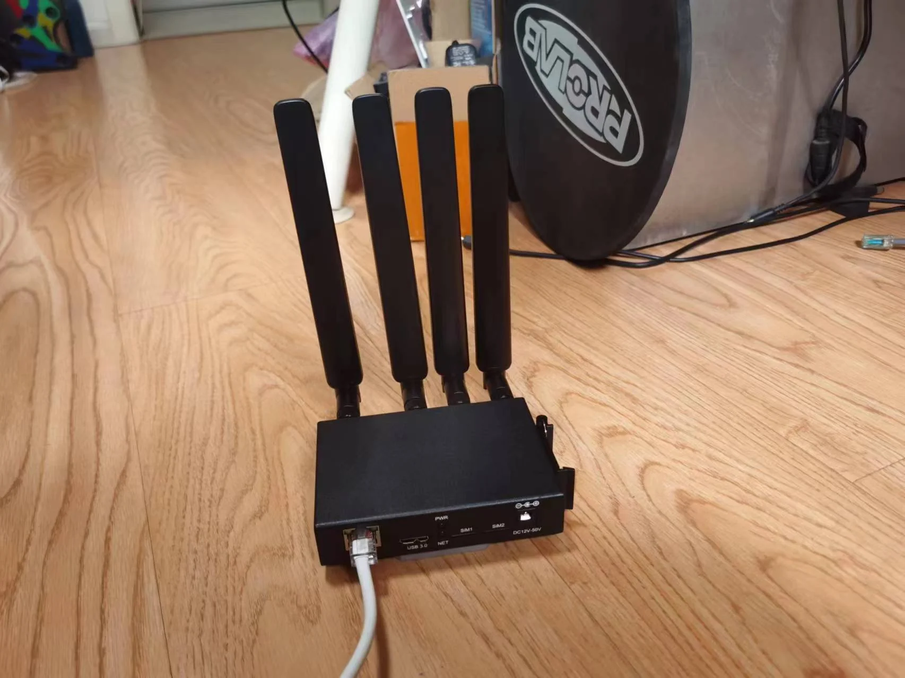
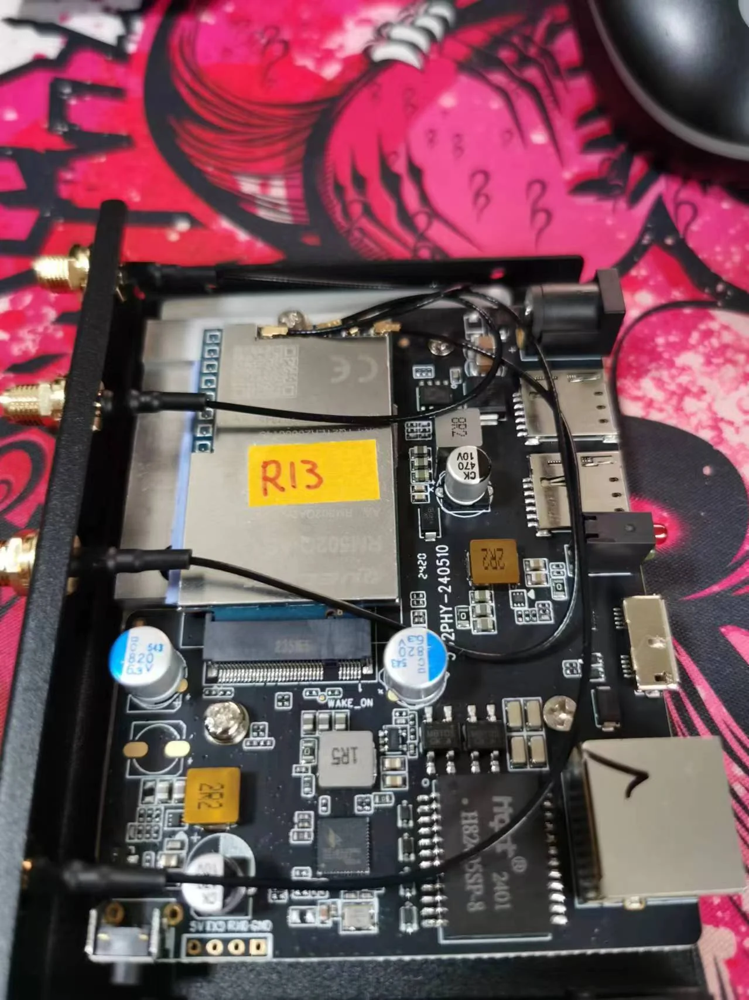
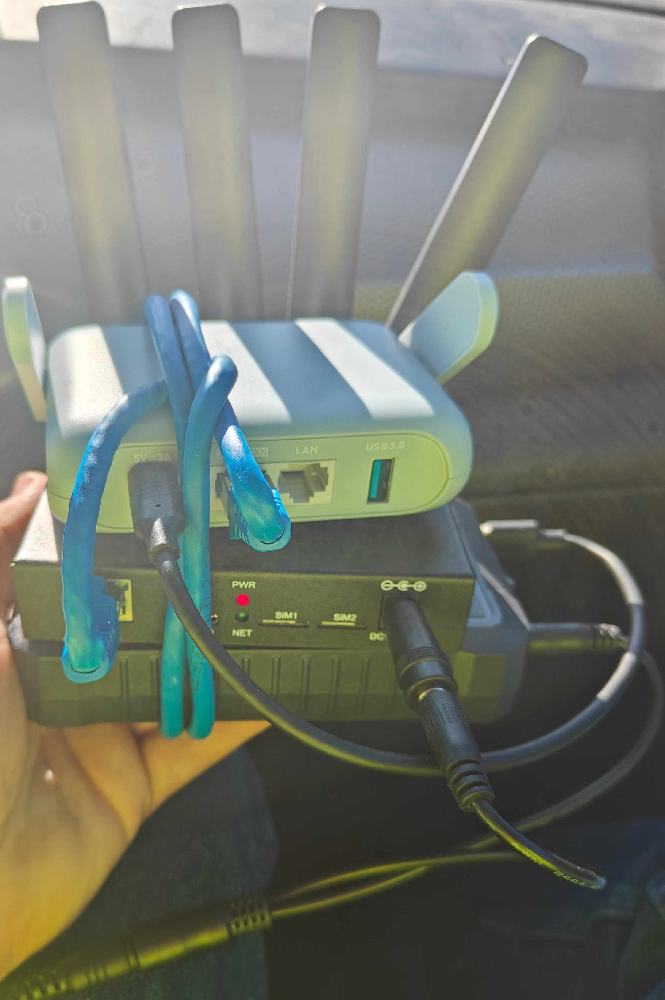
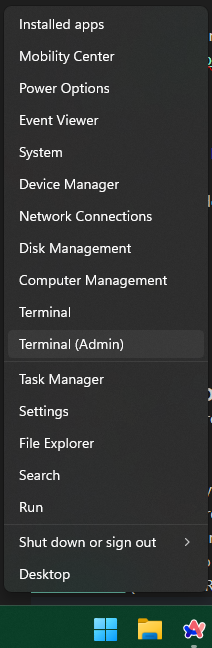

Quectel Modem Wiki
=================================
> :warning: This is a living document. Changes may be made as more discoveries are made or more community software is made. If you feel like you have information to contribute to this wiki please open a pull request.

# SDXLEMUR Direct M.2 Modem to Ethernet Guide


Many of Quectel's modems support directly connecting to a PCIe Ethernet chipset. This is useful to use the cellular connection as a WAN interface - you can just plug the modem into the WAN port on your router, do a bit of configuration, and you're good to go. Performance is good, and the modem's onboard connection management often works better than the scripts many routers use to try to keep the connection up.

**This guide is written for the following modems:**

[RM520N-GL](./RM520N-GL.md)
RM530N-GL (untested)
[RM521F-GL](./RM521F-GL.md)
***In theory any Quectel SDXLEMUR system utilized in an AP mode***

# Table of Contents

 - [Hardware and Assembly](#hardware-and-assembly)
	- [Indoor](#indoor)
	- [Outdoor](#outdoor)
	- [Portable](#Portable)
	- [Other Accessories](#other-accessories) 
	
- [Software and Setup](#software-and-setup)
	- [QuecDeploy](#quecdeploy)
	- [Basic initial setup](#basic-initial-setup)
	- [Unlocking ADB](#unlocking-adb)
	- [Using ADB](#using-adb)
    - [Web GUI and Toolkit](#web-gui-and-toolkit)
    - [Tailscale Installation and Config](#tailscale-installation-and-config)
- [Ending Notes](#ending-notes)


# Hardware and Assembly


Essentially what we are doing is placing the modem in PCIe Root Complex mode so it can utilize an ethernet chipset via PCIe. You will need a board that has an M.2 B-Key slot with Power, Ethernet, SIM slot(s), and USB on it along with a way to provide the modems 4 MHF4 connectors with the cell signal.
## Indoor

**Here's the hardware I recommend for an indoor or on the go scenario:**





**Assembly Video:**

*(coming soon!)*

**Purchase Links:**

Indoor Eth enclosure kit without modem:
[Dual-Q 5G2PHY](https://rework.network/collections/lte-home-gateway/products/5g2phy)

**OR**

With x62 [RM520N-GL](./RM520N-GL.md) (AP version modified/converted to normal AA).
Custom Arixolink firmware pre-flashed (Flash latest stock firmware if you want Simpleadmin 2.0 instead)
[Dual-Q 5G2PHY-RM520](https://www.rework.network/collections/lte-home-gateway/products/5g2phy-rm520) **(Currently Out of stock)**

**Standard Kit Includes:**
- Board and Case

- 40cm USB3.0 A Micro B Cable

- 2x 10cm MHF4 to SMA cable.

- 2x 15cm MHF4 to SMA cable.

- 1x 3x3.5x0.15 Silicone pad

- 1x 3x3x0.02 Silicone pad

- Mounting Hardware
- Small Heatsink for the onboard RTL8125 chipset

**Does not include**
- Power adapter
- Passive PoE injector/adapter
- Antennae

> You can buy the kit with the passive PoE adapter now included: https://www.rework.network/collections/lte-home-gateway/products/5g2phy-poe

> Rework.network sells a **set of antennae** separately here: https://www.rework.network/collections/antenna-accessories/products/lot-of-4-quectel-ye0007aa

**Key Features:** 

- 2.5 Gigabit RTL8125 single RJ45 port
- **Passive PoE supported**, I use a 24v passive injector 
  - :warning: **Active PoE like 802.11 will not work** :warning: as it does not negotiate
- USB 3.0
- 5.5x2.5mm DC port accepts a wide voltage range of 12-50V
- The built in thick aluminum heatsink is placed underneath the modem and extends under the board itself, keeping it nice and cool even under heavy load.
- The placement of the M.2 slot near the very edge of the board allows easy access to the contact points on the back of the modem in case you need to get it into EDL mode.

## Outdoor


https://www.rework.network/collections/lte-home-gateway/products/5g-rgm-o

*(Additional Photos and info coming soon)*

**Assembly Video:**

*(coming soon!)*

## Portable:

#### [Beryl AX](https://www.amazon.com/GL-iNet-GL-MT3000-Pocket-Sized-Wireless-Gigabit/dp/B0BPSGJN7T/ref=pd_dp_d_dp_dealz_related_hxwDSD_sspa_dk_detail_d_sccl_1_4/143-6202989-9416117?pd_rd_w=gyXrF&content-id=amzn1.sym.718c0e9e-df60-4a61-87d8-27ff0362dee1&pf_rd_p=718c0e9e-df60-4a61-87d8-27ff0362dee1&pf_rd_r=717MSS1MXJGNVW36931C&pd_rd_wg=vCfwG&pd_rd_r=69dba604-feb1-4a18-9faa-fae36dbd6813&pd_rd_i=B0BPSGJN7T&psc=1&sp_csd=d2lkZ2V0TmFtZT1zcF9kZXRhaWxfdGhlbWF0aWM=) plus [Indoor Modem](#indoor) plus Battery
- [Indoor Modem](#indoor)

- Travel WiFi Router: [GL.iNet Beryl AX](https://www.amazon.com/GL-iNet-GL-MT3000-Pocket-Sized-Wireless-Gigabit/dp/B0BPSGJN7T/ref=pd_dp_d_dp_dealz_related_hxwDSD_sspa_dk_detail_d_sccl_1_4/143-6202989-9416117?pd_rd_w=gyXrF&content-id=amzn1.sym.718c0e9e-df60-4a61-87d8-27ff0362dee1&pf_rd_p=718c0e9e-df60-4a61-87d8-27ff0362dee1&pf_rd_r=717MSS1MXJGNVW36931C&pd_rd_wg=vCfwG&pd_rd_r=69dba604-feb1-4a18-9faa-fae36dbd6813&pd_rd_i=B0BPSGJN7T&psc=1&sp_csd=d2lkZ2V0TmFtZT1zcF9kZXRhaWxfdGhlbWF0aWM=)
  - Rubber bands, zip ties, tape, Velcro, pick your favorite  :trollface:
  - [Short USBC to A cable](https://www.amazon.com/etguuds-Charging-Charger-Braided-Compatible/dp/B08933P982/ref=sr_1_3?crid=J131ZX2M386O&dib=eyJ2IjoiMSJ9.GywjpYp2bc5-8SJISwTc6W3kwgchqqXWTqo1Fo1FAXDa7-ieJoPDahrWkyWIC758tSzKuE3xykGy2XwQxcMk6IEHljpIgOvSpUME-TlAuGkmYSmTu01wFvSUN51DnWZRnKFiFQH8DpxEVZWLL6WRZXGvzUVdrOzs3vcKwnUn01DvZ9OvjfCyoxBFuLhveA0EqhQqz4LkotsyZqbp7-fQbgRAQdqvlXsRVJb7-038TVg.e31Plwf8cD1vndpIeQazjeQWFrPOC_vuTjInix2aobg&dib_tag=se&keywords=USBC+to+A+short&qid=1732753798&sprefix=usbc+to+a+shor%2Caps%2C197&sr=8-3)
  - [This Battery](https://www.amazon.com/gp/product/B0CQNQ7K8K/ref=ppx_yo_dt_b_search_asin_title?ie=UTF8&psc=1) 12v3A DC out, USB 5v3A out with passthrough charging
  - Eth Patch cable or short ethernet cable 

  - [5.5x2.1mm DC to 5.5x2.5mm DC adapter](https://www.amazon.com/gp/product/B07YWQ9N5S/ref=ppx_yo_dt_b_search_asin_title?ie=UTF8&psc=1)
 
 Result: 


## Other Accessories

- DC adapter: [12v 5A one from Amazon](https://www.amazon.com/gp/product/B01GEA8PQA/ref=ppx_yo_dt_b_search_asin_title?ie=UTF8&psc=1)

- Passive PoE: The one included with the outdoor antenna and indoor bundle is the best choice as they will link at 2.5gbps, but I would use a 24v passive injector if not.

- [MicroB to USB C converter 2-Pack](https://www.amazon.com/gp/product/B09LS3728B/ref=ppx_yo_dt_b_search_asin_title?ie=UTF8&psc=1)

- Indoor antennae [4 Pack from Rework.Network](https://www.rework.network/collections/antenna-accessories/products/lot-of-4-quectel-ye0007aa) (Untested; pick what you like)

- Home WiFi router: [GL.iNet Flint 2](https://www.amazon.com/GL-iNet-GL-MT6000-Multi-Gig-Connectivity-WireGuard/dp/B0CP7S3117?pd_rd_w=lAXSz&content-id=amzn1.sym.59910fa8-b73c-408a-aa5f-d0b4e0aa42cb&pf_rd_p=59910fa8-b73c-408a-aa5f-d0b4e0aa42cb&pf_rd_r=J8P5E4BQEY676GT05NP3&pd_rd_wg=QQO8w&pd_rd_r=f3fae9ae-ab4a-45d1-97bf-e43d119674bf&pd_rd_i=B0CP7S3117&psc=1&ref_=pd_bap_d_grid_rp_0_1_ec_nped_pd_rhf_cr_s_rp_c_d_sccl_1_2_t)

# Software and Setup

Now that you have your modem setup assembled we can move on to setting it up the connection, then the software and settings portion. 

For this process you'll need a Windows computer to set the modem up. I use Windows 11 for this but in theory this should work all the same for other versions. You can use Linux but you'll need to ensure that the option kernel module (driver) is installed.

>:warning: USB is not enough to power the modem on its own especially under load. :warning:
:bulb: Plug in extra power at the same time as USB. :bulb:
## QuecDeploy

**:arrow_right: [Download QuecDeploy](https://github.com/iamromulan/QuecDeploy/releases):arrow_left:**

To makes things easier for everyone, I created an exe called QuecDeploy. It's a very basic tool that gives you a list of options to pick from to Quickly Install/Deploy Quectel Software/Firmware. Eventually I'll improve it to do even more so be sure to add it to your watchlist.

What you need from QuecDeploy to be successful:
- Install the NDIS driver and the ECM driver only (Uninstall all other Quectel drivers)
- Install Qflash (adb is automatically installed along with it)
- Install Qnavigator
- Download the latest stock firmware for your modem

You can find guides on [how to flash firmware with Qflash](../flash_firmware_windows.md) and [how to send AT commands with Qnavagator](../qnavagator_guide.md) in the wiki as well. 
## Basic initial setup

> :bulb: **It is recommended to [Flash the latest stock firmware](../flash_firmware_windows.md) available before continuing.** 

If you are using Windows Ensure you have the latest NDIS driver installed, Qflash, and Qnavagator installed. This can be done with [QuecDeploy](#quecdeploy) 

For Linux you'll need the option.ko driver compiled and installed, minicom or microcom for AT commands, and Qfirehose for flashing firmware. More info on this to come. This guide is mainly for Windows users.

Connect to the modem by USB and run these AT Commands in Qnavagator.

> :bulb: Hint: [How to send AT commands with Qnavagator](../qnavagator_guide.md)
> :warning: Remember to uncheck automatic initialization in Qnavagator! 


**To get the Ethernet port working:**

```
AT+QCFG="data_interface",0,0
AT+QETH="eth_driver","r8125",1
AT+QCFG="pcie/mode",1
AT+QCFG="usbnet",1
AT+CFUN=1,1
```

Modem will reboot after sending `AT+CFUN=1,1`

**To get your cellular connection up:**

This process is dependent on the requirements of your provider and plan. 

**Basic:**

```
AT+CGDCONT=1,"IPV4V6","apn-here-inside-of-quotes"

AT+EGMR=0,7
[Reads currently set IMEI to you]


AT+EGMR=1,7,"imeinumberhere"
[Repairs the IMEI to something else if incorrect]

AT+CFUN=1,1
```

Sometimes after a reboot a default MBN Profile will override the APN you set. Here are a few useful commands to help you figure out what's going on. By default the data call will happen with PDP context 1 (APN 1).

**Further Connection troubleshooting:** 

```
AT+QSIMSTAT?
[Check if a SIM is detected in the selected slot. 0,0 no 0,1 yes]

AT+QUIMSLOT?
[Checks what SIM slot is selected]

AT+QUIMSLOT=1
[Switch to SIM Slot 1]

AT+QENG="servingcell"
[Will show you the signal info and connection status to the provider. NOCONN is normal and LIMSERV is not. LIMSERV usualy means the APN is wrong]

AT+QMAP="WWAN"
[Will show if you have an IP address assigned from your provider]

AT+CDGCONT?
[Will list currently set APN's in each PDP context]

AT+CGDCONT=1,"IPV4V6","apn-here-inside-of-quotes"
[Sets the APN you want in PDP Context 1]

AT+QMBNCFG="AutoSel"
[Check to see if automatic MBN selection is enabled. 1 yes 0 no]

AT+QMBNCFG="AutoSel",0
[Disable Automatic MBN selection]

AT+QMBNCFG="deactivate"
[Will deactivate the currently active MBN profile]

AT+QMBNCFG="list"
[Lists the MBN profiles avalble to pick. The first one is usualy the last used one or current one in use.]

AT+QMBNCFG="select","mbn_profile_name_here"
[Will set an MBN profile as active from the list]

AT+CFUN=0
[Module minimum function mode, will disconnect the radio]

AT+CFUN=1
[Module full function mode, will connect the radio]

```

It can be very useful to cfun 0 then 1 after changing the APN to avoid a full reboot. MBN edits need AT+CFUN=1,1 (full reboot) to take effect.

At this point you should be up and running with internet out the ethernet port. Keep USB plugged in for now as we will need it to continue.
## Unlocking ADB

By default, these modems do not have ADB over USB turned on, and they need to be unlocked when doing so for the first time.

> :bowtie: Thanks to [carp4](https://github.com/carp4) for their work on the [qadbkey-unlock python script](https://github.com/carp4/qadbkey-unlock) we can do this without Quectel's help now!

To get access, you need to get a lock code from the modem, then give that to the python ADB unlock keygen, take the unlock key code it gives you, unlock ADB, and then actually enable ADB over USB. This only needs to be done once, as this survives firmware flashing.

To get the lock code, run the AT command "AT+QADBKEY?". The modem will reply with:
```
AT+QADBKEY?
+QADBKEY: 12345678
OK
```
12345678 being the lock code in this case

#### Input that lock code into [The Python ADB unlock key Generator](https://onecompiler.com/python/3znepjcsq)**


**Replace the 12345678 with the response you got from running `AT+QADBKEY?`** then click run. Under output your unlock key will be generated.


Once you have received the unlock key, you apply the key like this:
```
AT+QADBKEY="0jXKXQwSwMxYoeg"
```

Then, to actually enable ADB, run `AT+QCFG="usbcfg"`, take the output, change the second-to-last 0 to 1, and then send the new usbcfg string to the modem 

**:warning: DO _NOT_ just copy/paste what's below; the USB VID/PID for your modem are very likely different) :warning:**

Example:

```control
AT+QCFG="usbcfg"
+QCFG: "usbcfg",0x2C7C,0x0801,1,1,1,1,1,0,0 // Initial response
AT+QCFG="usbcfg",0x2C7C,0x0801,1,1,1,1,1,1,0 // Enable ADB
```

:warning: The qcfg usbcfg command is very dangerous and can leave your modem inaccessible if used incorrectly. Those other 1s need to stay 1. They control what is enabled or disabled over USB.

And reboot with `AT+CFUN=1,1` to actually apply.

## Using ADB

The adb CLI tool must be available for use (installed) before continuing. If you installed Qflash with [QuecDeploy](#quecdeploy) then adb is available already. 

In most cases you shouldn't need any additional drivers for adb to work but just in case you do then you can use [this adb and fastboot driver installer bat I found.](https://github.com/fawazahmed0/Latest-adb-fastboot-installer-for-windows/releases)
### Basic usage:

adb is used in Command Prompt/PowerShell/Windows Terminal on Windows

On most versions of windows you can right click on start, then click either `Terminal (Admin)` or `PowerShell (Admin)`




**Once you are at a command line**:

 - Run `adb devices` to make sure your modem is detected by adb
 - Run `adb shell ping 8.8.8.8` to make sure the shell can access the internet. If you get an error, make sure the modem is connected to a cellular network
 - If you don't get an error you should be getting replies back endlessly, press `CTRL-C` to stop it.
 - Simply Copy/Paste this into your Command Prompt/Shell 

** **
## Web GUI and Toolkit

```
adb shell
```

Then copy paste (right click in window to paste)

```
cd /tmp && wget -O RMxxx_rgmii_toolkit.sh https://raw.githubusercontent.com/iamromulan/quectel-rgmii-toolkit/SDXLEMUR/RMxxx_rgmii_toolkit.sh && chmod +x RMxxx_rgmii_toolkit.sh && ./RMxxx_rgmii_toolkit.sh && cd /
```

**You should see:**


You can set your TTL via option 3 (Simple Firewall Management) if needed but mainly, choose option 2 to install simpleadmin 2.0 

There will be 2 points it asks you to set a password. It won't look like you are typing anything but you are. One is the admin password for login to simpleadmin and the other is the root password for accessing the console. You may set the same or different. Up to you.

Once that completes you should be able to go to https://192.168.225.1/ (ignore the security warning/proceed anyways) and use simpleadmin 2.0

## Tailscale Installation and Config

> :warning: Your modem must already be connected to the internet for this to install
### Installation:
Open up the toolkit main menu and **press 4** to enter the Tailscale menu


**Press 1, wait for it to install. This is a very large file for the system so give it some time.**

**Once done and it says Tailscale installed successfully press 2/enter to configure it.**


If you want to, enable the Tailscale Web UI on port 8088 for configuration from the browser later by **pressing 1/enter**.

To do it in the toolkit:
First time connecting you'll be given a link to login with
 - Press 3 to just connect only.
 - Press 4 to connect and enable SSH access (remote command line) over tailscale.
 - Press 5 to reconnect with SSH off while connected with SSH on
 - Press 6 to disconnect
 - Press 7 to Logout

That's it! From another device running tailscale you should be able to access your modem through the IP assigned to it by your tailnet. To access SSH from another device on the tailnet, open a terminal/command prompt and type

    tailscale ssh root@(IP or Hostname)
IP or Hostname being the IP or hostname assigned to it in your tailnet

 - Note that your SSH client must be able to give you a link to sign in with upon connecting. That's how the session is authorized. Works fine in Windows CMD or on Android use JuiceSSH.
## Ending notes

Simpleadmin 2.0 is going away eventually when I have time to revisit SDXLEMUR/SDXPRAIRIE. The plan is to improve the userspace and bring as much as I can from our adventures on SDXPINN. Hopefully I will even have a flash-able firmware out for these modems so we can skip adb.

If you are looking for the advanced stuff and some of the things I removed from this guide check out [SDXLEMUR Advanced](./sdxlemur_advanced.md)